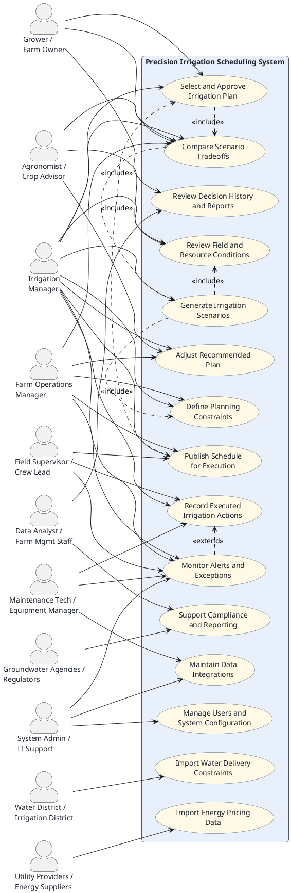

### Use Case Diagram

```plantuml
@startuml
left to right direction
skinparam shadowing false
skinparam packageStyle rectangle
skinparam defaultFontName Arial
skinparam defaultFontSize 14
skinparam actorStyle awesome

skinparam usecase {
  BackgroundColor #FFF9E6
  BorderColor #4A5568
  FontColor #1A202C
}

skinparam rectangle {
  BackgroundColor #E8F1FB
  BorderColor #4A5568
  FontColor #1A202C
  RoundCorner 12
}

skinparam actor {
  FontColor #1A202C
}

actor "Grower /\nFarm Owner" as Grower
actor "Irrigation\nManager" as IrrMgr
actor "Farm Operations\nManager" as OpsMgr
actor "Field Supervisor /\nCrew Lead" as CrewLead
actor "Agronomist /\nCrop Advisor" as Agronomist
actor "System Admin /\nIT Support" as IT
actor "Data Analyst /\nFarm Mgmt Staff" as Analyst
actor "Maintenance Tech /\nEquipment Manager" as Maint
actor "Water District /\nIrrigation District" as District
actor "Groundwater Agencies /\nRegulators" as Regulators
actor "Utility Providers /\nEnergy Suppliers" as Utility

rectangle "Precision Irrigation Scheduling System" {

  usecase "Review Field and\nResource Conditions" as UC1
  usecase "Define Planning\nConstraints" as UC2
  usecase "Generate Irrigation\nScenarios" as UC3
  usecase "Compare Scenario\nTradeoffs" as UC4
  usecase "Select and Approve\nIrrigation Plan" as UC5
  usecase "Adjust Recommended\nPlan" as UC6
  usecase "Publish Schedule\nfor Execution" as UC7
  usecase "Record Executed\nIrrigation Actions" as UC8
  usecase "Review Decision History\nand Reports" as UC9
  usecase "Monitor Alerts and\nExceptions" as UC10
  usecase "Manage Users and\nSystem Configuration" as UC11
  usecase "Maintain Data\nIntegrations" as UC12
  usecase "Import Water Delivery\nConstraints" as UC13
  usecase "Import Energy Pricing\nData" as UC14
  usecase "Support Compliance\nand Reporting" as UC15
}

Grower --> UC4
Grower --> UC5
Grower --> UC9

IrrMgr --> UC1
IrrMgr --> UC2
IrrMgr --> UC3
IrrMgr --> UC4
IrrMgr --> UC5
IrrMgr --> UC6
IrrMgr --> UC7
IrrMgr --> UC8
IrrMgr --> UC10

OpsMgr --> UC2
OpsMgr --> UC4
OpsMgr --> UC6
OpsMgr --> UC7
OpsMgr --> UC10

CrewLead --> UC7
CrewLead --> UC8
CrewLead --> UC10

Agronomist --> UC1
Agronomist --> UC4
Agronomist --> UC6

Analyst --> UC9
Analyst --> UC15

IT --> UC11
IT --> UC12
IT --> UC10

Maint --> UC10
Maint --> UC12
Maint --> UC8

District --> UC13
Regulators --> UC15
Utility --> UC14

UC3 .> UC1 : <<include>>
UC3 .> UC2 : <<include>>
UC4 .> UC3 : <<include>>
UC5 .> UC4 : <<include>>
UC7 .> UC5 : <<include>>
UC10 .> UC8 : <<extend>>

@enduml
```
