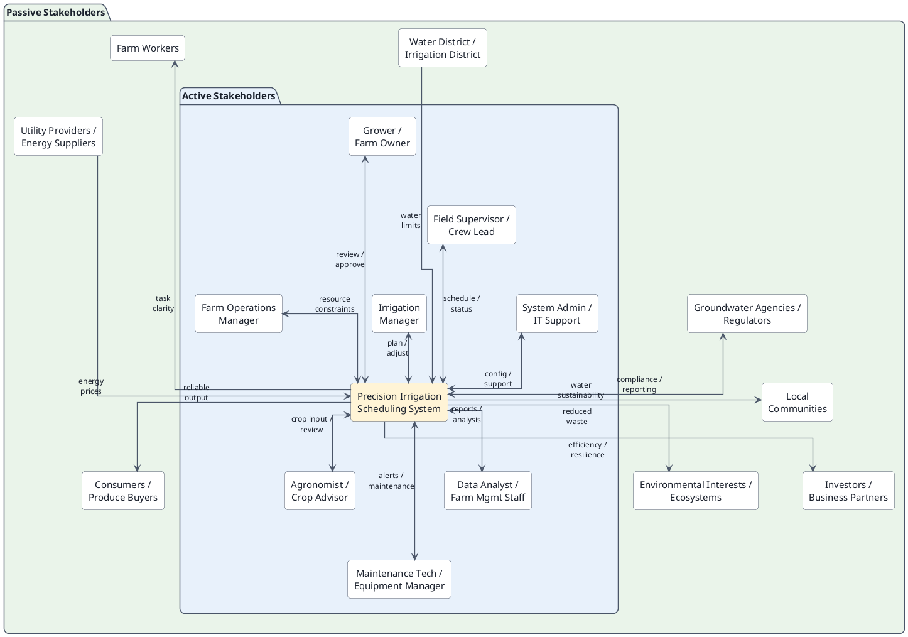
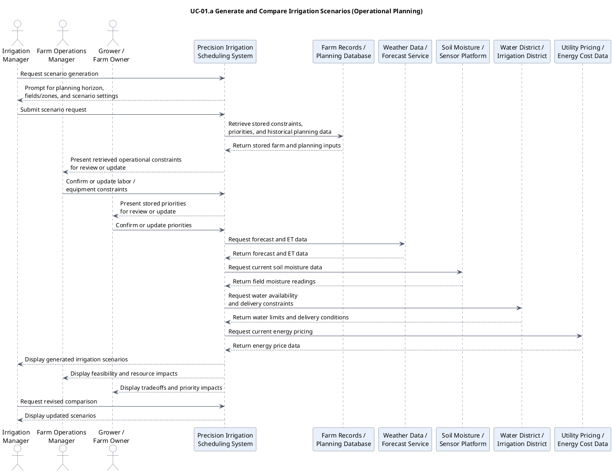
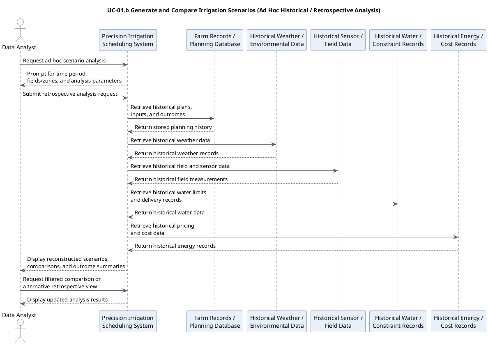
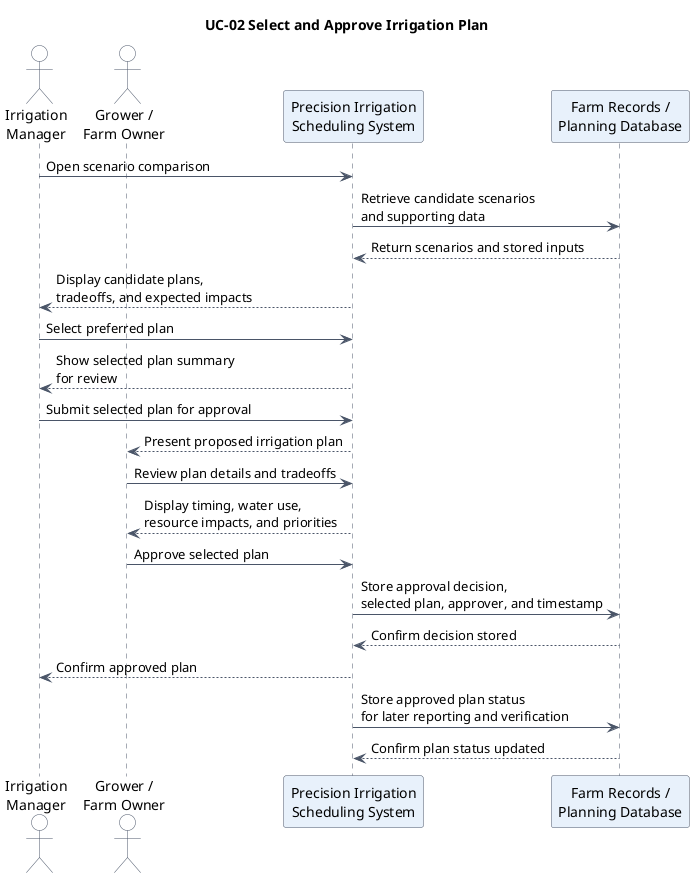
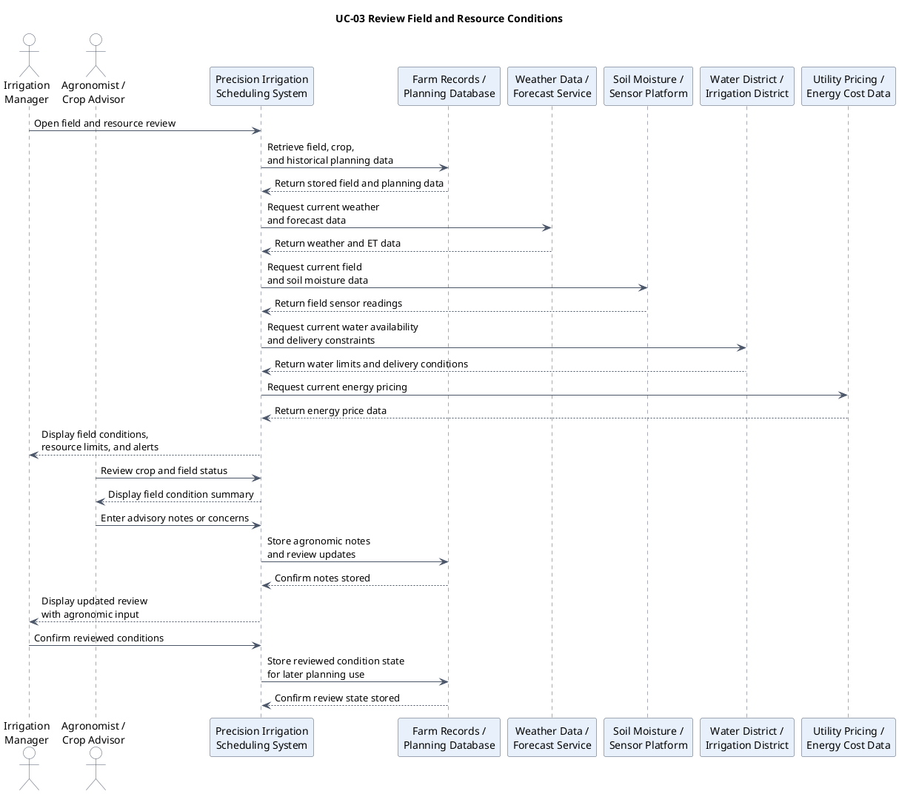
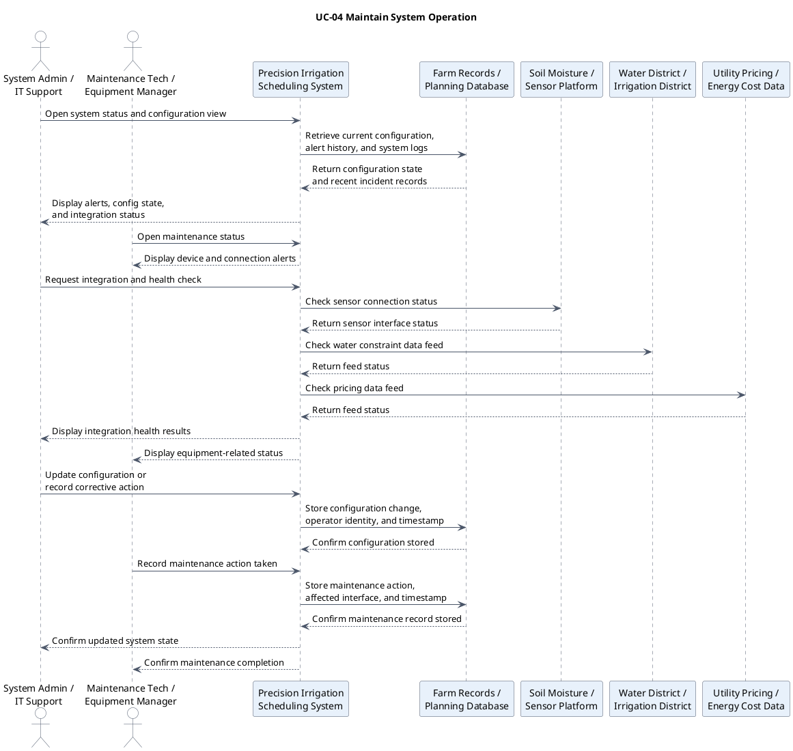
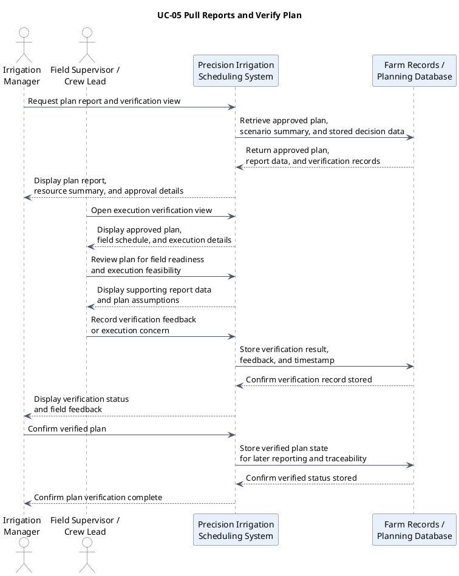
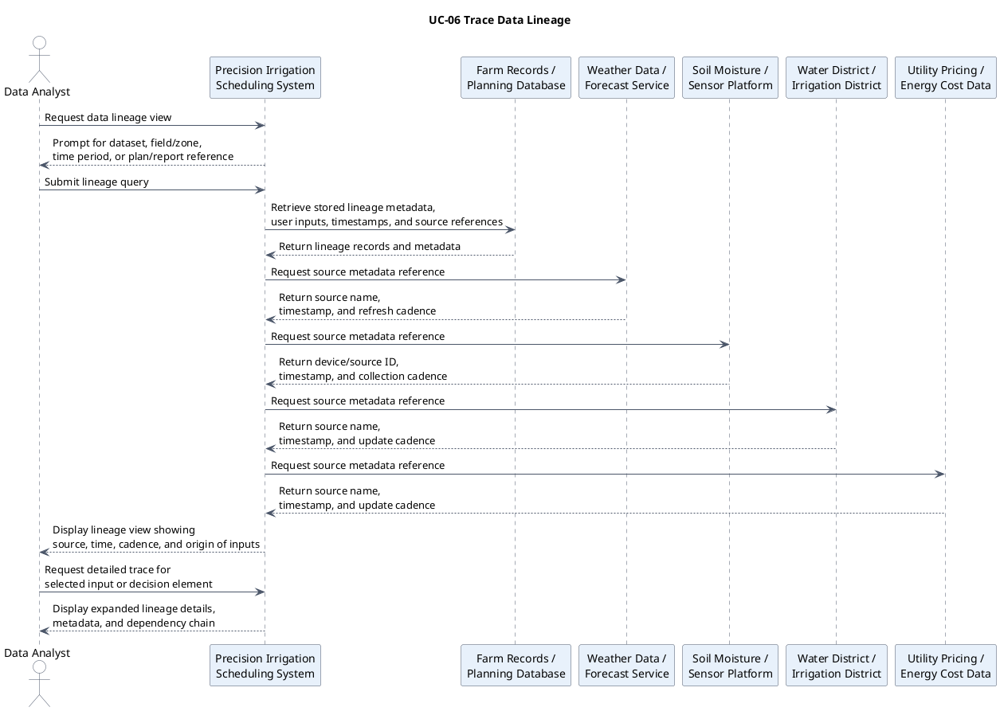
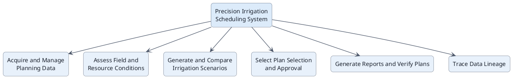

## System Context

```plantuml
@startuml
top to bottom direction
skinparam shadowing false
skinparam linetype ortho
skinparam defaultFontName Arial
skinparam defaultTextAlignment center
skinparam defaultFontSize 15
skinparam nodesep 70
skinparam ranksep 80

skinparam ArrowColor #4A5568
skinparam ArrowThickness 1.3
skinparam ArrowFontColor #1A202C
skinparam ArrowFontSize 12

skinparam rectangle {
  RoundCorner 10
  BorderColor #4A5568
  FontColor #1A202C
  BackgroundColor #FFFFFF
}

skinparam package {
  RoundCorner 16
  BorderColor #4A5568
  FontColor #1A202C
  BackgroundColor #FFFFFF
}

package "Passive Stakeholders" as PASSIVE #EAF4EA {

  rectangle "Farm Workers" as Workers
  rectangle "Water District /\nIrrigation District" as District
  rectangle "Groundwater Agencies /\nRegulators" as Regulators

  rectangle "Utility Providers /\nEnergy Suppliers" as Utility

  package "Active Stakeholders" as ACTIVE #E8F1FB {
    rectangle "Grower /\nFarm Owner" as Grower
    rectangle "Irrigation\nManager" as IrrMgr
    rectangle "Farm Operations\nManager" as OpsMgr

    rectangle "Field Supervisor /\nCrew Lead" as CrewLead
    rectangle "Precision Irrigation\nScheduling System" as System #FFF4D6
    rectangle "Agronomist /\nCrop Advisor" as Agronomist

    rectangle "System Admin /\nIT Support" as IT
    rectangle "Data Analyst /\nFarm Mgmt Staff" as Analyst
    rectangle "Maintenance Tech /\nEquipment Manager" as Maint
  }

  rectangle "Local\nCommunities" as Community

  rectangle "Consumers /\nProduce Buyers" as Buyers
  rectangle "Environmental Interests /\nEcosystems" as Enviro
  rectangle "Investors /\nBusiness Partners" as Investors
}

' -----------------------------
' Active stakeholder layout
' -----------------------------
Grower -[hidden]right- IrrMgr
IrrMgr -[hidden]right- OpsMgr

CrewLead -[hidden]right- System
System -[hidden]right- Agronomist

IT -[hidden]right- Analyst
Analyst -[hidden]right- Maint

Grower -[hidden]down- CrewLead
CrewLead -[hidden]down- IT

IrrMgr -[hidden]down- System
System -[hidden]down- Analyst

OpsMgr -[hidden]down- Agronomist
Agronomist -[hidden]down- Maint

' -----------------------------
' Passive stakeholder layout
' -----------------------------
Workers -[hidden]right- District
District -[hidden]right- Regulators

Workers -[hidden]down- Utility
District -[hidden]down- ACTIVE
Regulators -[hidden]down- Community

Utility -[hidden]right- ACTIVE
ACTIVE -[hidden]right- Community

Utility -[hidden]down- Buyers
ACTIVE -[hidden]down- Enviro
Community -[hidden]down- Investors

Buyers -[hidden]right- Enviro
Enviro -[hidden]right- Investors

' -----------------------------
' Active stakeholder interactions
' -----------------------------
Grower <--> System : review /\napprove
IrrMgr <--> System : plan /\nadjust
OpsMgr <--> System : resource\nconstraints
CrewLead <--> System : schedule /\nstatus
Agronomist <--> System : crop input /\nreview
IT <--> System : config /\nsupport
Analyst <--> System : reports /\nanalysis
Maint <--> System : alerts /\nmaintenance

' -----------------------------
' Passive stakeholder relationships
' -----------------------------
System -left-> Workers : task\nclarity
District -down-> System : water\nlimits
Regulators <-right-> System : compliance /\nreporting

Utility -right-> System : energy\nprices
System -right-> Community : water\nsustainability

System -down-> Buyers : reliable\noutput
System -down-> Enviro : reduced\nwaste
System -down-> Investors : efficiency /\nresilience

@enduml
```

### 5.7.1 UC-01

```plantuml
@startuml
title UC-01.a Generate and Compare Irrigation Scenarios (Operational Planning)

skinparam shadowing false
skinparam defaultFontName Arial
skinparam sequence {
  ArrowColor #4A5568
  LifeLineBorderColor #4A5568
  LifeLineBackgroundColor #FFFFFF
  ParticipantBorderColor #4A5568
  ParticipantBackgroundColor #E8F1FB
  ActorBorderColor #4A5568
  ActorBackgroundColor #FFFFFF
}

actor "Irrigation\nManager" as IrrMgr
actor "Farm Operations\nManager" as OpsMgr
actor "Grower /\nFarm Owner" as Grower

participant "Precision Irrigation\nScheduling System" as System
participant "Farm Records /\nPlanning Database" as Records
participant "Weather Data /\nForecast Service" as Weather
participant "Soil Moisture /\nSensor Platform" as Sensors
participant "Water District /\nIrrigation District" as District
participant "Utility Pricing /\nEnergy Cost Data" as Utility

IrrMgr -> System : Request scenario generation
System --> IrrMgr : Prompt for planning horizon,\nfields/zones, and scenario settings

IrrMgr -> System : Submit scenario request
System -> Records : Retrieve stored constraints,\npriorities, and historical planning data
Records --> System : Return stored farm and planning inputs

System --> OpsMgr : Present retrieved operational constraints\nfor review or update
OpsMgr -> System : Confirm or update labor /\nequipment constraints

System --> Grower : Present stored priorities\nfor review or update
Grower -> System : Confirm or update priorities

System -> Weather : Request forecast and ET data
Weather --> System : Return forecast and ET data

System -> Sensors : Request current soil moisture data
Sensors --> System : Return field moisture readings

System -> District : Request water availability\nand delivery constraints
District --> System : Return water limits and delivery conditions

System -> Utility : Request current energy pricing
Utility --> System : Return energy price data

System --> IrrMgr : Display generated irrigation scenarios
System --> OpsMgr : Display feasibility and resource impacts
System --> Grower : Display tradeoffs and priority impacts

IrrMgr -> System : Request revised comparison
System --> IrrMgr : Display updated scenarios

@enduml
```

```plantuml
@startuml
title UC-01.b Generate and Compare Irrigation Scenarios (Ad Hoc Historical / Retrospective Analysis)

skinparam shadowing false
skinparam defaultFontName Arial
skinparam sequence {
  ArrowColor #4A5568
  LifeLineBorderColor #4A5568
  LifeLineBackgroundColor #FFFFFF
  ParticipantBorderColor #4A5568
  ParticipantBackgroundColor #E8F1FB
  ActorBorderColor #4A5568
  ActorBackgroundColor #FFFFFF
}

actor "Data Analyst" as Analyst

participant "Precision Irrigation\nScheduling System" as System
participant "Farm Records /\nPlanning Database" as Records
participant "Historical Weather /\nEnvironmental Data" as HistWeather
participant "Historical Sensor /\nField Data" as HistSensors
participant "Historical Water /\nConstraint Records" as HistWater
participant "Historical Energy /\nCost Records" as HistEnergy

Analyst -> System : Request ad hoc scenario analysis
System --> Analyst : Prompt for time period,\nfields/zones, and analysis parameters

Analyst -> System : Submit retrospective analysis request
System -> Records : Retrieve historical plans,\ninputs, and outcomes
Records --> System : Return stored planning history

System -> HistWeather : Retrieve historical weather data
HistWeather --> System : Return historical weather records

System -> HistSensors : Retrieve historical field and sensor data
HistSensors --> System : Return historical field measurements

System -> HistWater : Retrieve historical water limits\nand delivery records
HistWater --> System : Return historical water data

System -> HistEnergy : Retrieve historical pricing\nand cost data
HistEnergy --> System : Return historical energy records

System --> Analyst : Display reconstructed scenarios,\ncomparisons, and outcome summaries
Analyst -> System : Request filtered comparison or\nalternative retrospective view
System --> Analyst : Display updated analysis results

@enduml
```

### 5.7.2 UC-02

```plantuml
@startuml
title UC-02 Select and Approve Irrigation Plan

skinparam shadowing false
skinparam defaultFontName Arial
skinparam sequence {
  ArrowColor #4A5568
  LifeLineBorderColor #4A5568
  LifeLineBackgroundColor #FFFFFF
  ParticipantBorderColor #4A5568
  ParticipantBackgroundColor #E8F1FB
  ActorBorderColor #4A5568
  ActorBackgroundColor #FFFFFF
}

actor "Irrigation\nManager" as IrrMgr
actor "Grower /\nFarm Owner" as Grower

participant "Precision Irrigation\nScheduling System" as System
participant "Farm Records /\nPlanning Database" as Records

IrrMgr -> System : Open scenario comparison
System -> Records : Retrieve candidate scenarios\nand supporting data
Records --> System : Return scenarios and stored inputs
System --> IrrMgr : Display candidate plans,\ntradeoffs, and expected impacts

IrrMgr -> System : Select preferred plan
System --> IrrMgr : Show selected plan summary\nfor review

IrrMgr -> System : Submit selected plan for approval
System --> Grower : Present proposed irrigation plan

Grower -> System : Review plan details and tradeoffs
System --> Grower : Display timing, water use,\nresource impacts, and priorities

Grower -> System : Approve selected plan
System -> Records : Store approval decision,\nselected plan, approver, and timestamp
Records --> System : Confirm decision stored

System --> IrrMgr : Confirm approved plan
System -> Records : Store approved plan status\nfor later reporting and verification
Records --> System : Confirm plan status updated

@enduml
```

### 5.7.3 UC-03

```plantuml
@startuml
title UC-03 Review Field and Resource Conditions

skinparam shadowing false
skinparam defaultFontName Arial
skinparam sequence {
  ArrowColor #4A5568
  LifeLineBorderColor #4A5568
  LifeLineBackgroundColor #FFFFFF
  ParticipantBorderColor #4A5568
  ParticipantBackgroundColor #E8F1FB
  ActorBorderColor #4A5568
  ActorBackgroundColor #FFFFFF
}

actor "Irrigation\nManager" as IrrMgr
actor "Agronomist /\nCrop Advisor" as Agronomist

participant "Precision Irrigation\nScheduling System" as System
participant "Farm Records /\nPlanning Database" as Records
participant "Weather Data /\nForecast Service" as Weather
participant "Soil Moisture /\nSensor Platform" as Sensors
participant "Water District /\nIrrigation District" as District
participant "Utility Pricing /\nEnergy Cost Data" as Utility

IrrMgr -> System : Open field and resource review
System -> Records : Retrieve field, crop,\nand historical planning data
Records --> System : Return stored field and planning data

System -> Weather : Request current weather\nand forecast data
Weather --> System : Return weather and ET data

System -> Sensors : Request current field\nand soil moisture data
Sensors --> System : Return field sensor readings

System -> District : Request current water availability\nand delivery constraints
District --> System : Return water limits and delivery conditions

System -> Utility : Request current energy pricing
Utility --> System : Return energy price data

System --> IrrMgr : Display field conditions,\nresource limits, and alerts

Agronomist -> System : Review crop and field status
System --> Agronomist : Display field condition summary

Agronomist -> System : Enter advisory notes or concerns
System -> Records : Store agronomic notes\nand review updates
Records --> System : Confirm notes stored

System --> IrrMgr : Display updated review\nwith agronomic input

IrrMgr -> System : Confirm reviewed conditions
System -> Records : Store reviewed condition state\nfor later planning use
Records --> System : Confirm review state stored

@enduml
```

### 5.7.4 UC-04

```plantuml
@startuml
title UC-04 Maintain System Operation

skinparam shadowing false
skinparam defaultFontName Arial
skinparam sequence {
  ArrowColor #4A5568
  LifeLineBorderColor #4A5568
  LifeLineBackgroundColor #FFFFFF
  ParticipantBorderColor #4A5568
  ParticipantBackgroundColor #E8F1FB
  ActorBorderColor #4A5568
  ActorBackgroundColor #FFFFFF
}

actor "System Admin /\nIT Support" as IT
actor "Maintenance Tech /\nEquipment Manager" as Maint

participant "Precision Irrigation\nScheduling System" as System
participant "Farm Records /\nPlanning Database" as Records
participant "Soil Moisture /\nSensor Platform" as Sensors
participant "Water District /\nIrrigation District" as District
participant "Utility Pricing /\nEnergy Cost Data" as Utility

IT -> System : Open system status and configuration view
System -> Records : Retrieve current configuration,\nalert history, and system logs
Records --> System : Return configuration state\nand recent incident records
System --> IT : Display alerts, config state,\nand integration status

Maint -> System : Open maintenance status
System --> Maint : Display device and connection alerts

IT -> System : Request integration and health check
System -> Sensors : Check sensor connection status
Sensors --> System : Return sensor interface status

System -> District : Check water constraint data feed
District --> System : Return feed status

System -> Utility : Check pricing data feed
Utility --> System : Return feed status

System --> IT : Display integration health results
System --> Maint : Display equipment-related status

IT -> System : Update configuration or\nrecord corrective action
System -> Records : Store configuration change,\noperator identity, and timestamp
Records --> System : Confirm configuration stored

Maint -> System : Record maintenance action taken
System -> Records : Store maintenance action,\naffected interface, and timestamp
Records --> System : Confirm maintenance record stored

System --> IT : Confirm updated system state
System --> Maint : Confirm maintenance completion

@enduml
```

### 5.7.5 UC-05

```plantuml
@startuml
title UC-05 Pull Reports and Verify Plan

skinparam shadowing false
skinparam defaultFontName Arial
skinparam sequence {
  ArrowColor #4A5568
  LifeLineBorderColor #4A5568
  LifeLineBackgroundColor #FFFFFF
  ParticipantBorderColor #4A5568
  ParticipantBackgroundColor #E8F1FB
  ActorBorderColor #4A5568
  ActorBackgroundColor #FFFFFF
}

actor "Irrigation\nManager" as IrrMgr
actor "Field Supervisor /\nCrew Lead" as CrewLead

participant "Precision Irrigation\nScheduling System" as System
participant "Farm Records /\nPlanning Database" as Records

IrrMgr -> System : Request plan report and verification view
System -> Records : Retrieve approved plan,\nscenario summary, and stored decision data
Records --> System : Return approved plan,\nreport data, and verification records
System --> IrrMgr : Display plan report,\nresource summary, and approval details

CrewLead -> System : Open execution verification view
System --> CrewLead : Display approved plan,\nfield schedule, and execution details

CrewLead -> System : Review plan for field readiness\nand execution feasibility
System --> CrewLead : Display supporting report data\nand plan assumptions

CrewLead -> System : Record verification feedback\nor execution concern
System -> Records : Store verification result,\nfeedback, and timestamp
Records --> System : Confirm verification record stored

System --> IrrMgr : Display verification status\nand field feedback

IrrMgr -> System : Confirm verified plan
System -> Records : Store verified plan state\nfor later reporting and traceability
Records --> System : Confirm verified status stored

System --> IrrMgr : Confirm plan verification complete

@enduml
```

### 5.7.6 UC-06

```plantuml
@startuml
title UC-06 Trace Data Lineage

skinparam shadowing false
skinparam defaultFontName Arial
skinparam sequence {
  ArrowColor #4A5568
  LifeLineBorderColor #4A5568
  LifeLineBackgroundColor #FFFFFF
  ParticipantBorderColor #4A5568
  ParticipantBackgroundColor #E8F1FB
  ActorBorderColor #4A5568
  ActorBackgroundColor #FFFFFF
}

actor "Data Analyst" as Analyst

participant "Precision Irrigation\nScheduling System" as System
participant "Farm Records /\nPlanning Database" as Records
participant "Weather Data /\nForecast Service" as Weather
participant "Soil Moisture /\nSensor Platform" as Sensors
participant "Water District /\nIrrigation District" as District
participant "Utility Pricing /\nEnergy Cost Data" as Utility

Analyst -> System : Request data lineage view
System --> Analyst : Prompt for dataset, field/zone,\ntime period, or plan/report reference

Analyst -> System : Submit lineage query
System -> Records : Retrieve stored lineage metadata,\nuser inputs, timestamps, and source references
Records --> System : Return lineage records and metadata

System -> Weather : Request source metadata reference
Weather --> System : Return source name,\ntimestamp, and refresh cadence

System -> Sensors : Request source metadata reference
Sensors --> System : Return device/source ID,\ntimestamp, and collection cadence

System -> District : Request source metadata reference
District --> System : Return source name,\ntimestamp, and update cadence

System -> Utility : Request source metadata reference
Utility --> System : Return source name,\ntimestamp, and update cadence

System --> Analyst : Display lineage view showing\nsource, time, cadence, and origin of inputs

Analyst -> System : Request detailed trace for\nselected input or decision element
System --> Analyst : Display expanded lineage details,\nmetadata, and dependency chain

@enduml
```

### 6.2 System decomposition

```plantuml
@startuml
top to bottom direction
skinparam shadowing false
skinparam defaultFontName Arial
skinparam defaultTextAlignment center
skinparam defaultFontSize 14
skinparam ArrowColor #4A5568
skinparam ArrowThickness 1.2

skinparam rectangle {
  RoundCorner 12
  BorderColor #4A5568
  FontColor #1A202C
  BackgroundColor #E8F1FB
}

rectangle "Precision Irrigation\nScheduling System" as Root #DCEBFA

rectangle "Acquire and Manage\nPlanning Data" as F1
rectangle "Assess Field and\nResource Conditions" as F2
rectangle "Generate and Compare\nIrrigation Scenarios" as F3
rectangle "Select Plan Selection\nand Approval" as F4
rectangle "Generate Reports and Verify Plans" as F5
rectangle "Trace Data Lineage" as F6

Root -down-> F1
Root -down-> F2
Root -down-> F3
Root -down-> F4
Root -down-> F5
Root -down-> F6

@enduml
```