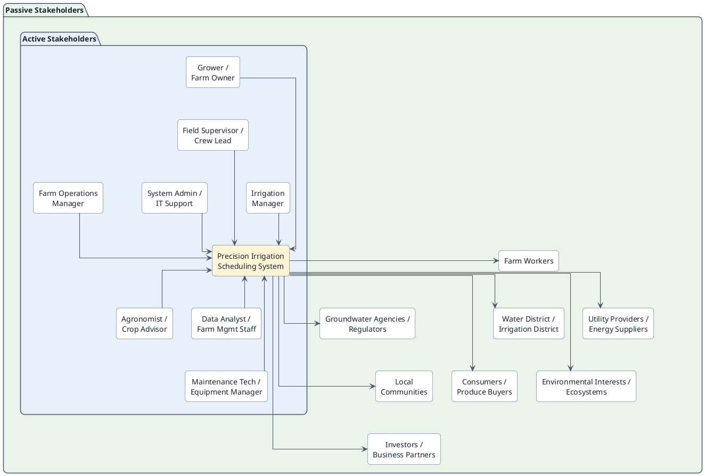

# Table of Contents

1. [Introduction](#1-introduction)
    1. [Background](#11-background)
    2. [Problem](#12-problem)
    3. [Need](#13-need)
        1. [Formal Needs Statement](#131-formal-needs-statement)
    4. [Job to Be Done](#14-job-to-be-done)
    5. [Future Success](#15-future-success)

2. [Current Situation](#2-current-situation)
    1. [Current Systems and Operations](#21-current-systems-and-operations)
        1. [Human Actors](#211-human-actors)
        2. [Technologies and Tools Currently Used](#212-technologies-and-tools-currently-used)
        3. [Typical Characteristics of the Current System](#213-typical-characteristics-of-the-current-system)
        4. [Typical Current Operational Flow](#214-typical-current-operational-flow)
    2. [Deficiencies and Opportunities](#22-deficiencies-and-opportunities)
        1. [Opportunities for Improvement](#221-opportunities-for-improvement)

3. [Stakeholder Analysis](#3-stakeholder-analysis)
    1. [Stakeholder Identification and Analysis](#31-stakeholder-identification-and-analysis)
        1. [Active Stakeholders](#311-active-stakeholders)
        2. [Passive Stakeholders](#312-passive-stakeholders)
    2. [Stakeholder Requirements](#32-stakeholder-requirements)
        1. [Capabilities](#321-capabilities)
        2. [Characteristics](#322-characteristics)
    3. [Stakeholder Needs Mapping](#33-stakeholder-needs-mapping)
        1. [Capability and Characteristic Key](#331-capability-and-characteristic-key)
        2. [Stakeholder Needs Mapping Table](#332-stakeholder-needs-mapping-table)
        3. [Interpretation](#333-interpretation)

4. [Acceptance Criteria](#4-acceptance-criteria)
    1. [Defined Acceptance Criteria](#41-defined-acceptance-criteria)
    2. [Explanation of Acceptance Criteria](#42-explanation-of-acceptance-criteria)

5. [Concept for the Proposed System](#5-concept-for-the-proposed-system)
    1. [Concept Generation](#51-concept-generation)
    2. [CONOPS](#52-conops)
    3. [Concept Selection](#53-concept-selection)
        1. [Pugh Matrix](#531-pugh-matrix)
    4. [System Context](#54-system-context)
    5. ["To Be" Operational Scenarios](#55-to-be-operational-scenarios)
    6. [Use Case Model](#56-use-case-model)
    7. [Use Case Specifications](#57-use-case-specifications)
        1. [Sequence Diagram](#571-sequence-diagram)
    8. [QFD Analysis](#58-qfd-analysis)
        1. [QFD Matrix](#581-qfd-matrix)
    9. [System Requirements](#59-system-requirements)

6. [Functional and Physical Architecture](#6-functional-and-physical-architecture)
    1. [Input/Output Matrices](#61-inputoutput-matrices)
    2. [First Level Decomposition](#62-first-level-decomposition)
    3. [IDEF0 Model](#63-idef0-model)

7. [Risk Assessment](#7-risk-assessment)
    1. [Technical Performance Measures](#71-technical-performance-measures)
    2. [Risk Management Plan](#72-risk-management-plan)

8. [Reflection](#8-reflection)

9. [Conclusion](#9-conclusion)

---

# 1. Introduction

## 1.1 Background

Agricultural producers in California’s Central Valley operate in an environment shaped by recurring water scarcity, variable rainfall, rising groundwater pumping costs, increasing energy costs, and uncertainty related to water allocation policies and regulatory oversight. At the same time, growers must continue to protect crop health, maintain yield, and operate within practical constraints such as labor availability, irrigation infrastructure capacity, and field-level variability in soil and crop conditions.

Irrigation decisions are therefore no longer simple timing decisions. They require balancing agronomic, economic, environmental, and operational factors across multiple fields over time. In many farming operations, these decisions are still made using a combination of grower experience, static schedules, spreadsheets, disconnected sensor tools, controller interfaces, and manual field observation. While these methods can work, they are difficult to scale and often do not provide integrated support for timely, optimized decision-making under uncertainty.

## 1.2 Problem

Current irrigation planning and execution methods do not adequately support growers and irrigation managers in determining when, where, and how much to irrigate under changing and uncertain conditions. Relevant information is often fragmented across weather data, soil moisture readings, pump records, field observations, water delivery constraints, and cost considerations. As a result, irrigation scheduling is frequently reactive, inconsistent, and dependent on individual judgment rather than supported by structured system-level analysis.

This creates several risks. Water may be over-applied, increasing waste and pumping cost. Water may also be under-applied, stressing crops and reducing yield or quality. Limited water resources may not be allocated to the highest-priority fields at the right time. Managers may also struggle to justify or document decisions in the face of operational, financial, or regulatory pressure.

The challenge is sufficiently complex that it cannot be addressed well through a single calculation or isolated manual process. It involves multiple data sources, multiple stakeholders, competing objectives, and repeated decisions over time.

## 1.3 Need

Central Valley growers and irrigation managers need a better way to make field-level irrigation decisions under uncertain and changing conditions. They need support that helps them integrate agronomic, environmental, operational, and economic information so they can decide when irrigation should occur, how much water should be applied, and how to prioritize irrigation actions when water, energy, or pumping capacity is constrained.

That need suggests the value of a software-intensive decision-support system that can gather inputs, analyze constraints, generate recommendations, and support human decision-making across changing conditions.

The system should help users:

- determine when irrigation should occur
- determine how much water should be applied
- prioritize irrigation actions when water or pumping capacity is constrained
- adapt recommendations when weather, water supply, or field conditions change
- document decisions and outcomes for operational review and accountability

There is a well-defined paying customer for such a system. The most likely sponsor or customer would be a farm owner, agricultural enterprise, vineyard operator, orchard operator, irrigation management company, or large grower organization that bears the cost of water use inefficiency, pumping energy, and crop-performance loss. In some cases, irrigation districts, water agencies, or agricultural service providers could also serve as sponsors if the system were positioned as a regional efficiency or advisory platform.

Likely users include growers, irrigation managers, farm operations managers, field supervisors, and possibly agronomists or crop advisors. The envisioned system would interact with weather data services, soil moisture sensors, irrigation controllers, pump or flow monitoring systems, farm records, and possibly utility pricing data or water allocation records.

### 1.3.1 Formal Needs Statement

California Central Valley growers and irrigation managers operate under increasing pressure from water scarcity, variable rainfall, rising pumping and energy costs, and uncertainty in water supply and regulation. Current irrigation planning methods rely on fragmented data, manual coordination, and experience-based judgment, which can lead to inefficient water use, inconsistent scheduling, and difficulty adapting to changing conditions. These challenges are sufficiently complex to require a software-intensive system that integrates environmental, agronomic, operational, and cost information to support field-level irrigation decisions. The need is supported by a clear customer base, including farms and agricultural operations that directly bear the financial and operational consequences of poor irrigation decisions. A successful solution would enable users to create adaptive, explainable, and efficient irrigation schedules that reduce waste, manage cost, and improve resilience under uncertainty. Multiple conceptual solutions are possible, including decision-support dashboards, optimization tools, and semi-automated irrigation control systems.

## 1.4 Job to Be Done

The primary job to be done is to enable growers and irrigation managers to make timely, defensible irrigation decisions that deliver sufficient water to crops while minimizing waste, pumping cost, and exposure to water-supply uncertainty. This job exists independently of any specific software solution because farms must continuously decide when, where, and how much to irrigate in order to sustain crop performance and manage limited water resources.

This job is persistent and well-defined because growers already must decide when and how much to irrigate; the decision must happen regardless of whether a software solution exists. Poor decisions have direct cost, water-use, and yield consequences. The problem is recurring, operational, and high-stakes.

## 1.5 Future Success

A successful future state would be one in which irrigation decisions are no longer based primarily on disconnected tools and informal judgment, but instead are supported by a unified system that provides timely, explainable, and operationally feasible recommendations.

Success would look like:

- irrigation schedules are generated at the field or zone level using current and forecasted conditions
- users can quickly understand why the system is recommending a specific irrigation action
- water use becomes more efficient without harming crop health or yield
- pumping is reduced or shifted more intelligently when cost is high
- scarce water is allocated more deliberately during shortage conditions
- managers can track decisions, changes, and outcomes over time
- the farm operation becomes more resilient to uncertainty in rainfall, supply, and regulation

# 2. Current Situation

## 2.1 Current Systems and Operations

In the current situation, irrigation decisions are often made using a mix of human judgment, manual coordination, and partially connected tools. Typical decision inputs include grower experience, fixed irrigation calendars, manual field inspection, weather reports, pump and flow records, spreadsheets or handwritten logs, recommendations from agronomists or irrigation consultants, and data from disconnected tools such as soil moisture sensors, weather stations, or controller systems.

In many operations, irrigation planning and execution do not occur through a single integrated system. Instead, the current operational environment is a patchwork of spreadsheets, handwritten records, weather applications, sensor dashboards, irrigation controllers, and direct communication with field crews. Scheduling decisions are therefore often made manually and revised reactively as conditions change.

The typical process involves assessing field conditions, estimating water demand, checking operational and resource constraints, scheduling irrigation by field or block, executing the plan through pumps and valves or automated controllers, and monitoring outcomes through field inspection and later adjustments.

#### 2.1.1 Human Actors

The current irrigation decision environment involves several human actors, each with a distinct role in planning, approving, executing, or responding to irrigation activity. The grower or farm owner is often the primary decision-maker or the person ultimately accountable for crop performance, water use, and operating cost. In some operations, that person makes irrigation decisions directly; in others, authority is shared with or delegated to an irrigation manager. The irrigation manager typically plays the central operational role by interpreting conditions across fields, balancing resource constraints, and translating priorities into an irrigation schedule. Field supervisors may help coordinate labor, verify field conditions, and communicate changing needs or problems from the field to management. Equipment operators are responsible for implementing the plan by running pumps, opening or closing valves, adjusting controller settings, and ensuring that irrigation equipment is functioning as intended. Agronomists or crop advisors may also influence decisions by providing recommendations based on crop condition, soil behavior, weather patterns, or production goals. In addition, external stakeholders such as water districts or regulators can shape operations by imposing delivery schedules, reporting requirements, allocation limits, or compliance constraints that must be considered during planning and execution.

#### 2.1.2 Technologies and Tools Currently Used

The technologies and tools currently used in many irrigation operations are often practical and familiar, but they are not always well integrated. Manual valve and pump controls are still common, especially in operations where physical infrastructure has developed over time and automation is partial rather than comprehensive. Irrigation controllers or timers may be used to automate portions of watering activity, but they often operate independently from broader planning tools or decision logic. Spreadsheets and paper logs remain common for tracking schedules, water use, observations, and operational notes, particularly because they are flexible and easy for local staff to modify. Weather apps or local forecasts are frequently consulted to anticipate heat, rainfall, or evapotranspiration-related conditions, while standalone soil moisture sensors provide additional field-specific information where they are installed. Larger operations may also use SCADA systems or pump-monitoring tools to track equipment status, flows, and runtime, but these systems are often focused on equipment oversight rather than integrated irrigation decision support. Communication between managers and field crews often relies on phone calls or text messages, which are useful for immediate coordination but may not create a durable or structured decision record. Accounting records and utility bills may later be used to review pumping cost, but this information is often analyzed after the fact rather than incorporated directly into daily irrigation planning.

### 2.1.3 Typical Characteristics of the Current System

Taken together, the current system is typically characterized by fragmentation, human dependence, and limited analytical integration. Information relevant to irrigation decisions is often spread across multiple sources, including field observations, controller settings, weather forecasts, sensor dashboards, utility records, and verbal communication, with no single system bringing those inputs together in a unified way.

As a result, decision quality depends heavily on the experience and judgment of individual growers or irrigation managers, whose intuition may be strong but difficult to scale, transfer, or standardize across time and personnel. Real-time optimization is usually limited, meaning that even when useful data exists, it may not be processed quickly or systematically enough to support dynamic adjustments. Decisions are often made at the field level and sometimes at the block level, but not always at the finer irrigation-zone level where more precise control could improve outcomes.

The system is also frequently reactive, with adjustments made after crop stress, runoff, overwatering, or delivery problems are observed rather than prevented in advance. Most importantly, there is often weak integration between agronomic considerations, operational realities, and economic constraints, making it difficult to consistently choose irrigation actions that are simultaneously good for crop health, resource efficiency, and overall farm performance.

### 2.1.4 Typical Current Operational Flow

| Step | Current Operation |
|---|---|
| 1. Assess conditions | Grower or irrigation manager reviews recent weather, looks at field conditions, checks soil visually or via sensors if available, and considers crop growth stage. |
| 2. Estimate need | Water demand is estimated based on experience, past schedules, crop type, recent temperatures, and expected rainfall. |
| 3. Check constraints | Labor availability, pump capacity, water allotments, irrigation district deliveries, energy cost, and equipment limitations are considered. |
| 4. Create schedule | A daily or weekly irrigation plan is created for each field or block, often manually. |
| 5. Execute irrigation | Workers run pumps, valves, pivots, drip systems, or set controller programs. |
| 6. Monitor results | The team checks whether irrigation occurred as intended and watches for signs of plant stress, runoff, or overwatering. |
| 7. Adjust | The next schedule is adjusted based on observed conditions, supply changes, or weather shifts. |

## 2.2 Deficiencies and Opportunities

Current irrigation planning is often manual, fragmented, and heavily dependent on experience rather than integrated analysis. Data relevant to irrigation decisions is spread across multiple sources, and scheduling is often reactive or based on fixed routines that do not adapt well to weather, soil, crop stage, cost, or water-supply constraints.

1. Irrigation decisions rely too heavily on individual judgment

   Many farms depend on the experience of growers or irrigation managers to decide when and how much to water. That experience is valuable, but it can also make decision-making inconsistent, hard to scale, and vulnerable when knowledgeable personnel are unavailable. Watering decisions may vary from person to person, may not be documented clearly, and may be difficult to repeat consistently across seasons, fields, or staff.

2. Data is fragmented across multiple tools and people

   Relevant information is often spread across weather apps, soil sensors, controller interfaces, pump records, spreadsheets, handwritten notes, and verbal communication with crews. These pieces are rarely integrated into one decision-support view. Managers must mentally combine multiple data sources, which increases effort, slows decisions, and raises the risk that important information will be overlooked.

3. Scheduling is often reactive instead of proactive

   Current practice often adjusts irrigation after visible signs of stress, changing weather, supply disruption, or unexpected operational issues appear. Even where planning exists, it may be based on fixed routines rather than dynamic conditions. Fields may be overwatered or underwatered before corrections are made, reducing efficiency and potentially affecting crop quality or yield.

4. Fixed schedules do not adapt well to changing conditions

   Many irrigation schedules are based on habit, historical practice, or generalized assumptions. However, actual water needs can change with temperature, crop growth stage, recent irrigation, rainfall, and soil variation. Water is not always applied in the right amount or at the right time, which can create waste, stress plants, and increase pumping costs.

5. Current systems may not account well for resource constraints

   Even when crop water needs are understood, decisions must also reflect real constraints such as limited water allocation, well output, pump capacity, labor availability, and electricity cost. The resulting schedule may be agronomically reasonable but operationally inefficient or financially costly.

6. Limited support for uncertainty and risk

   Water availability can change due to drought, rainfall variability, delivery restrictions, groundwater limitations, or regulatory changes. Most current practices do not provide structured support for making irrigation decisions under uncertain future conditions. Managers may be forced to make high-stakes decisions without clear visibility into tradeoffs, contingency plans, or likely outcomes.

7. Poor traceability and justification of decisions

   When decisions are made informally, it can be difficult to explain why a certain field was irrigated, why another was deferred, or why water use changed over time. This makes management review, performance improvement, and possible compliance or reporting tasks harder.

8. Difficulty prioritizing across multiple fields or zones

   When water, pumping capacity, or labor is limited, managers need to decide which fields or irrigation zones should receive water first. Current methods may not support systematic prioritization. Resources may be allocated inefficiently, especially during shortage conditions.

### 2.2.1 Opportunities for Improvement

These deficiencies create a clear opportunity for an integrated software-based precision irrigation scheduling system. Such a system could combine environmental, agronomic, and operational data into a unified decision-support platform and generate adaptive irrigation recommendations for each field or zone. By helping users determine when, where, and how much to irrigate under changing conditions, the system could improve water-use efficiency, reduce pumping cost, support better prioritization under scarcity, and increase the consistency and traceability of irrigation decisions.

1. Integrate relevant irrigation data into one platform

   A software system could combine weather forecasts, crop data, soil moisture readings, irrigation history, field-zone information, and operational constraints into one view. This will reduce mental workload and improve decision quality by making relevant information easier to access and interpret.

2. Provide decision support for optimal irrigation scheduling

   Instead of relying only on intuition or fixed calendars, the system could recommend irrigation timing and quantity for each field or zone based on current and forecasted conditions. This will improve water-use efficiency while maintaining crop health.

3. Adapt recommendations dynamically as conditions change

   The system could update schedules when weather forecasts shift, rainfall occurs, pumps fail, water allocations change, or sensor readings indicate unusual conditions. This will enable more proactive and resilient irrigation planning.

4. Balance agronomic, operational, and economic factors

   The software could account not just for plant water needs, but also for pumping costs, energy timing, equipment limitations, and water availability. A system can potentially support decisions that are both agronomically sound and operationally realistic.

5. Help prioritize water use under scarcity

   When water is limited, the system could rank fields or zones based on urgency, crop sensitivity, expected impact, or management priorities. A system will improve outcomes during shortage periods and make tradeoffs more explicit.

6. Increase consistency and transparency of decisions

   A structured system can document assumptions, recommendations, actions, and changes over time. This makes decisions easier to explain, evaluate, and improve across seasons.

7. Reduce waste and avoid unnecessary pumping expense

   By applying water more precisely and only when needed, the system could reduce over-irrigation and support more efficient pump usage. A system can help lower operating cost while conserving water.

8. Create a foundation for future automation or compliance support

   Even if the initial concept is a recommendation system rather than a control system, it could later connect to irrigation controllers, reporting tools, or regulatory documentation workflows. A recommendation system can provide long-term extensibility beyond basic scheduling.

# 3. Stakeholder Analysis

## 3.1 Stakeholder Identification and Analysis

The proposed precision irrigation scheduling system has both active and passive stakeholders. Active stakeholders are those who directly interact with, operate, configure, maintain, or make decisions with the system or depend on it to perform operational decisions. These include the grower or farm owner, irrigation manager, farm operations manager, field supervisor, irrigation crew lead, agronomist, and system support personnel. These stakeholders use the system to plan irrigation, review recommendations, allocate resources, execute field activities, and monitor performance.

Passive stakeholders are affected by the system’s outcomes but do not directly operate it. These include water districts, regulators, utility providers, local communities, consumers, environmental interests, and business stakeholders. Their interests relate to efficient water use, sustainability, cost control, agricultural reliability, and reduced environmental impact.

### 3.1.1 Active Stakeholders

| Stakeholder | Why they are active | Main interest in the system |
|---|---|---|
| **Grower / Farm Owner** | May use the system to review schedules, approve actions, and monitor performance | Lower water use, protect yield, reduce cost, improve farm profitability |
| **Irrigation Manager** | Primary day-to-day user who creates, adjusts, or executes irrigation plans using the system | Accurate recommendations, easy scheduling, better prioritization under scarcity |
| **Farm Operations Manager** | Uses the system to coordinate labor, equipment, and field activities | Operational efficiency, resource coordination, fewer disruptions |
| **Field Supervisor / Irrigation Crew Lead** | Uses schedule outputs to carry out watering tasks in the field | Clear instructions, realistic schedules, fewer manual errors |
| **Agronomist / Crop Advisor** | May review recommendations and provide crop-specific input | Maintain crop health, align irrigation with agronomic best practice |
| **System Administrator / IT Support** | Configures users, integrations, permissions, and system availability | Reliability, maintainability, secure access |
| **Data Analyst / Farm Management Staff** | May review historical reports, water-use trends, and performance data | Better reporting, trend analysis, management insight |
| **Maintenance Technician / Equipment Manager** | Uses system outputs or alerts related to pumps, valves, or sensors | Early warning of issues, reduced downtime, easier troubleshooting |

### 3.1.2 Passive Stakeholders

| Stakeholder | Why they are passive | Main interest in the system |
|---|---|---|
| **Farm Workers** | Affected by scheduling decisions and work allocation, but may not directly use the system | Predictable workload, clear operations, safe working conditions |
| **Water District / Irrigation District** | Affected by how efficiently water is used and how demand is managed | Efficient allocation, reduced waste, better demand predictability |
| **Groundwater Sustainability Agencies / Regulators** | Concerned with water use, conservation, and compliance outcomes rather than direct operation | Better water stewardship, reduced overuse, possible compliance support |
| **Utility Providers / Energy Suppliers** | Indirectly affected by pumping demand and time-of-use consumption | More predictable demand, off-peak usage patterns |
| **Local Communities** | Impacted by regional water sustainability and agricultural stability | Sustainable water use, economic stability, environmental responsibility |
| **Consumers / Produce Buyers** | Do not use the system, but may be affected by crop quality, yield stability, and price | Reliable agricultural output, crop quality |
| **Environmental Interests / Ecosystems** | Affected by groundwater withdrawal, runoff, and water-use efficiency | Reduced waste, less environmental stress |
| **Investors / Business Partners** | Interested in profitability and operational resilience, not daily system use | Lower risk, better efficiency, better business performance |

## 3.2 Stakeholder Requirements

### 3.2.1 Capabilities

Capabilities: The proposed system should be capable of integrating environmental, agronomic, and operational data; estimating crop water demand; generating adaptive irrigation schedules; accounting for water, energy, and infrastructure constraints; prioritizing irrigation under scarcity; explaining recommendations; and tracking irrigation decisions and outcomes over time.

1. **Collect and integrate data**  
   The system should gather data from weather forecasts, historical weather, soil moisture sensors, crop profiles, field maps, irrigation history, pump data, and water availability records.

2. **Estimate irrigation demand**  
   It should estimate crop water needs for each field or irrigation zone based on crop type, growth stage, soil conditions, and forecasted weather.

3. **Generate irrigation schedules**  
   The system should recommend when irrigation should occur, where it should occur, and how much water should be applied.

4. **Adjust recommendations dynamically**  
   It should update recommendations when rainfall changes, temperatures shift, sensors detect unusual moisture conditions, or water supply constraints change.

5. **Support prioritization under scarcity**  
   When water, pumping capacity, labor, or time is limited, the system should help rank fields or zones by urgency and expected impact.

6. **Incorporate operational constraints**  
   The system should account for pump capacity, irrigation infrastructure limitations, labor availability, delivery windows, and energy pricing.

7. **Provide decision justification**  
   Users should be able to see why a recommendation was made, including the major inputs and tradeoffs that influenced it.

8. **Track irrigation actions and outcomes**  
   The system should record planned schedules, executed schedules, deviations, and outcomes for later review.

9. **Alert users to important conditions**  
   It should notify users about potential overwatering, underwatering, forecasted rain, equipment issues, or supply shortfalls.

10. **Support reporting and review**  
    The system should summarize water use, scheduling efficiency, missed recommendations, and seasonal patterns for managers. It should maintain historical records for analysis and accountability.

### 3.2.2 Characteristics

Characteristics: The system should be usable, reliable, scalable, flexible, explainable, and interoperable with relevant external data and control systems. It should support field- or zone-level decision-making, provide traceable recommendations, and remain effective under uncertain and changing conditions.

### Functional characteristics

* **Field-level or zone-level precision** rather than only whole-farm recommendations
* **Near real-time responsiveness** to changing conditions
* **Explainable outputs** rather than black-box recommendations only
* **Scenario-based planning**, such as normal supply vs restricted supply
* **Human-in-the-loop control**, especially for early versions

### Nonfunctional characteristics

* **Usable** The interface should be understandable for growers and irrigation managers, not just technical staff.
* **Reliable** It should provide recommendations consistently and continue operating even if some sensor data is temporarily unavailable.
* **Accurate enough to support trust** Recommendations do not need to be perfect, but they must be credible and consistently useful.
* **Scalable** It should work for multiple fields, zones, and crop types without becoming too hard to manage.
* **Flexible** The system should adapt to different farm sizes, irrigation methods, and available data sources.
* **Interoperable** It should be able to interact with external systems such as sensor platforms, weather APIs, irrigation controllers, and farm management software.
* **Traceable** Recommendations and actions should be logged so users can review what happened and why.
* **Maintainable** The system should be structured so models, thresholds, and integrations can be updated over time.
* **Secure** Farm data, operational records, and system access should be protected appropriately.

## 3.3 Stakeholder Needs Mapping

The following tables map stakeholder needs to the capabilities and characteristics required of the proposed system. The first table defines the capability and characteristic IDs used for traceability. The second table maps those IDs to each stakeholder.

### 3.3.1 Capability and Characteristic Key

| ID | Capability / Characteristic | Explanation |
|---|---|---|
| CAP-1 | Collect and integrate data | The system gathers and combines relevant weather, soil, crop, water, and operational data into a unified decision-support view. |
| CAP-2 | Estimate irrigation demand | The system estimates how much water is needed for each field or zone based on agronomic and environmental conditions. |
| CAP-3 | Generate irrigation schedules | The system recommends when, where, and how much irrigation should occur. |
| CAP-4 | Adjust recommendations dynamically | The system updates recommendations when weather, rainfall, soil moisture, or water-supply conditions change. |
| CAP-5 | Support prioritization under scarcity | The system helps users rank fields or zones when water, pumping capacity, labor, or time is limited. |
| CAP-6 | Incorporate operational constraints | The system accounts for pump limits, labor, energy cost, water delivery windows, and infrastructure constraints. |
| CAP-7 | Provide decision justification | The system explains why a recommendation was made and identifies the main drivers and tradeoffs. |
| CAP-8 | Track irrigation actions and outcomes | The system records recommendations, executed actions, deviations, and outcomes for later review. |
| CAP-9 | Alert users to important conditions | The system notifies users about significant conditions such as rainfall, stress risk, supply shortfalls, or equipment issues. |
| CAP-10 | Support reporting and review | The system summarizes historical performance, water use, schedule quality, and trends for management review. |
| CHR-1 | Usable | The system is understandable and practical for growers, irrigation managers, and operational users. |
| CHR-2 | Reliable | The system operates consistently and continues to provide useful support even when some inputs are delayed or incomplete. |
| CHR-3 | Accurate / Trustworthy | The system provides recommendations that are credible and consistently useful for decision-making. |
| CHR-4 | Scalable | The system can support multiple fields, zones, crops, and larger farm operations without major redesign. |
| CHR-5 | Flexible | The system can adapt to different farm sizes, irrigation methods, crops, and operating conditions. |
| CHR-6 | Interoperable | The system can exchange data with external sensors, APIs, controllers, and farm information systems. |
| CHR-7 | Traceable | The system preserves a record of recommendations, decisions, and outcomes so users can review what happened and why. |
| CHR-8 | Maintainable | The system can be updated over time as models, rules, integrations, and operating conditions evolve. |
| CHR-9 | Secure | The system protects farm data, user access, and operational records appropriately. |

### 3.3.2 Stakeholder Needs Mapping Table

| Stakeholder | Stakeholder Type | Capability | Characteristic |
|---|---|---|---|
| Grower / Farm Owner | Active | CAP-2, CAP-3, CAP-5, CAP-6, CAP-7, CAP-8, CAP-10 | CHR-1, CHR-2, CHR-3, CHR-5, CHR-7, CHR-9 |
| Irrigation Manager | Active | CAP-1, CAP-2, CAP-3, CAP-4, CAP-5, CAP-6, CAP-7, CAP-8, CAP-9, CAP-10 | CHR-1, CHR-2, CHR-3, CHR-5, CHR-6, CHR-7 |
| Farm Operations Manager | Active | CAP-3, CAP-4, CAP-5, CAP-6, CAP-8, CAP-9, CAP-10 | CHR-1, CHR-2, CHR-4, CHR-5, CHR-7 |
| Field Supervisor / Irrigation Crew Lead | Active | CAP-3, CAP-6, CAP-8, CAP-9 | CHR-1, CHR-2, CHR-6, CHR-7 |
| Agronomist / Crop Advisor | Active | CAP-1, CAP-2, CAP-3, CAP-4, CAP-7, CAP-10 | CHR-2, CHR-3, CHR-5, CHR-7 |
| System Administrator / IT Support | Active | CAP-1, CAP-8, CAP-9, CAP-10 | CHR-2, CHR-4, CHR-6, CHR-8, CHR-9 |
| Data Analyst / Farm Management Staff | Active | CAP-1, CAP-3, CAP-4, CAP-5, CAP-6, CAP-7, CAP-8, CAP-10 | CHR-2, CHR-3, CHR-4, CHR-6, CHR-7, CHR-8 |
| Maintenance Technician / Equipment Manager | Active | CAP-1, CAP-4, CAP-6, CAP-8, CAP-9 | CHR-2, CHR-3, CHR-6, CHR-7, CHR-8 |
| Farm Workers | Passive | CAP-3, CAP-8, CAP-9 | CHR-1, CHR-2 |
| Water District / Irrigation District | Passive | CAP-5, CAP-6, CAP-8, CAP-10 | CHR-2, CHR-4, CHR-7 |
| Groundwater Sustainability Agencies / Regulators | Passive | CAP-5, CAP-6, CAP-8, CAP-10 | CHR-2, CHR-7, CHR-9 |
| Utility Providers / Energy Suppliers | Passive | CAP-6, CAP-10 | CHR-2, CHR-4, CHR-7 |
| Local Communities | Passive | CAP-5, CAP-8, CAP-10 | CHR-2, CHR-7 |
| Consumers / Produce Buyers | Passive | CAP-2, CAP-3, CAP-10 | CHR-2, CHR-3, CHR-4 |
| Environmental Interests / Ecosystems | Passive | CAP-5, CAP-6, CAP-8, CAP-10 | CHR-2, CHR-7 |
| Investors / Business Partners | Passive | CAP-3, CAP-5, CAP-6, CAP-8, CAP-10 | CHR-2, CHR-4, CHR-7, CHR-9 |

### 3.3.3 Interpretation

This mapping shows that the grower and irrigation manager are the primary operational stakeholders and therefore require the broadest set of system capabilities. Their needs are closely tied to irrigation demand estimation, schedule generation, dynamic adjustment, prioritization under scarcity, decision justification, and recordkeeping. These stakeholders also depend strongly on usability, reliability, accuracy, flexibility, and traceability because they are responsible for making and defending irrigation decisions under real operational constraints.

Other active stakeholders, such as farm operations managers, field supervisors, agronomists, analysts, and maintenance personnel, depend on narrower but still important subsets of system capability. Their needs are more specialized, focusing on schedule execution, operational coordination, agronomic interpretation, historical review, equipment awareness, and communication of important conditions. As a result, their required system characteristics tend to emphasize reliability, interoperability, maintainability, and traceability.

Passive stakeholders generally do not interact directly with the system, but they are still affected by the quality of its outputs and the accountability of its decisions. Water districts, regulators, utility providers, communities, environmental interests, and business stakeholders depend less on direct usability and more on the system’s ability to support efficient resource use, constraint-aware scheduling, reporting, and documented decision history. This makes the mapping useful for later requirements development because it highlights which needs are operationally central and which are primarily concerned with oversight, performance, and long-term impact.

# 4. Acceptance Criteria

## 4.1 Defined Acceptance Criteria

| ID | Criterion | Testing Method |
|---|---|---|
| AC-1 | The system shall generate a field- or zone-level irrigation schedule within 5 minutes of user request under nominal operating conditions with all required inputs available. | Test |
| AC-2 | The system shall update affected irrigation recommendations within 10 minutes of receiving a significant change in weather, soil moisture, or water availability data. | Test |
| AC-3 | The system shall produce a prioritized irrigation schedule within defined water, pumping, and irrigation-time constraints when demand exceeds available resources. | Test, Analysis |
| AC-4 | The system shall display the field or zone, irrigation amount, irrigation timing, and three contributing factors for each recommendation under normal schedule generation. | Inspection |
| AC-5 | The system shall allow an authorized user to retrieve the complete 30-day decision history for any field or zone within 30 seconds. | Test |

## 4.2 Explanation of Acceptance Criteria

### 4.2.1 AC-1

**Focus:** schedule generation timeliness  
**Purpose:** verifies that the system produces a usable irrigation schedule quickly enough for operational planning.  
**Acceptance context:** nominal conditions, required inputs available, user-initiated schedule request.  
**Why it matters:** if schedule generation is too slow, the system is not operationally useful.

### 4.2.2 AC-2

**Focus:** adaptive update response  
**Purpose:** verifies that the system remains useful when important inputs change after an initial recommendation is generated.  
**Acceptance context:** changed forecast, soil moisture, or water availability input received by the system.  
**Why it matters:** irrigation planning must adapt to changing conditions, not remain static.

### 4.2.3 AC-3

**Focus:** constraint-aware prioritization  
**Purpose:** verifies that the system can support shortage conditions and produce feasible schedules rather than idealized ones.  
**Acceptance context:** total irrigation demand exceeds available resources for the planning period.  
**Why it matters:** this is one of the most important operational needs in the problem domain.

### 4.2.4 AC-4

**Focus:** recommendation explainability  
**Purpose:** verifies that users can understand the basis of each recommendation.  
**Acceptance context:** normal recommendation review by a grower or irrigation manager.  
**Why it matters:** the system will not be trusted or adopted if recommendations cannot be explained.

### 4.2.5 AC-5

**Focus:** decision traceability  
**Purpose:** verifies that the system preserves and retrieves a usable history of recommendations and actions.  
**Acceptance context:** authorized historical review of a selected field or zone over a defined time window.  
**Why it matters:** stakeholders need accountability, reviewability, and historical evidence for decisions.

# 5. Concept for the Proposed System

## 5.1 Concept Generation

To explore the design space, four candidate system concepts were identified. These concepts differ in scope, degree of automation, analytical sophistication, and integration with existing farm operations.

#### Concept 1: Baseline Digital Scheduling Workbook

The baseline concept is a minimal digital scheduling aid that consolidates irrigation-relevant inputs into a structured interface but does not perform advanced optimization or automation. It would allow an irrigation manager to manually enter or import weather observations, soil moisture readings, irrigation history, and operational notes into a single scheduling workbook or lightweight dashboard. The system would then organize these inputs into a simple field-by-field planning view and support basic schedule documentation.

This concept provides value primarily through improved organization, visibility, and traceability relative to paper logs or disconnected spreadsheets. However, it depends heavily on user judgment and offers limited analytical support beyond data consolidation.

#### Concept 2: Advisory Irrigation Recommendation Dashboard

This concept expands beyond simple data consolidation by providing recommendation support to a human decision-maker. The system would integrate weather forecasts, soil moisture data, crop information, irrigation history, and operational constraints to generate recommended irrigation timing and application amounts for each field or zone. The irrigation manager would remain in the loop, reviewing recommendations, making adjustments, and approving the final plan before execution.

This concept is distinct because it emphasizes explainable decision support rather than automation. Its primary strength is improving consistency, reducing mental workload, and helping users make defensible irrigation decisions without removing operator control.

#### Concept 3: Scenario-Based Optimization and Planning System

This concept focuses on comparative planning under uncertainty. Rather than generating only a single recommended schedule, the system would allow users to evaluate multiple irrigation strategies under different assumptions, such as restricted water supply, changing rainfall forecasts, varying energy prices, or different crop-priority rules. The system could compare alternatives and show tradeoffs in water use, pumping cost, field priority, and risk exposure.

This concept is distinct because it is designed not just for daily scheduling, but for decision analysis and contingency planning. It would be especially useful in periods of scarcity or uncertainty when managers need to understand the consequences of different allocation strategies before committing to one.

#### Concept 4: Semi-Autonomous Irrigation Coordination System

This concept includes decision support plus partial execution support. The system would generate irrigation schedules, allow human review and approval, and then transmit approved schedules to connected irrigation controllers, pump-control systems, or field execution tools. It could also monitor execution status and detect deviations such as missed runs, interrupted pump activity, or unexpected field conditions.

This concept is distinct because it extends beyond recommendation into operational coordination and partial automation. It offers the greatest potential for reducing manual workload and improving execution consistency, but it also introduces greater integration complexity, higher implementation cost, and stronger dependence on reliable external interfaces.

## 5.2 CONOPS

## 5.3 Concept Selection

### 5.3.1 Pugh Matrix

To compare the candidate system concepts, a weighted Pugh matrix was used. Each concept was evaluated against six criteria derived from stakeholder needs, operational priorities, and practical implementation concerns. Scores use a 1–5 scale, where **1 = poor**, **3 = moderate**, and **5 = strong**. Cost was weighted most heavily because affordability and implementation burden are major factors in whether a farming operation would adopt the system.

#### Evaluation Criteria and Weights

| Criterion | Description | Weight |
|---|---|---:|
| Cost | Expected development, deployment, integration, and operating cost | 5 |
| Decision Support Quality | Ability to improve irrigation timing, quantity, and prioritization decisions | 4 |
| Adaptability | Ability to respond to changing weather, soil, water, and operational conditions | 4 |
| Ease of Implementation | Relative difficulty of deployment, training, integration, and adoption | 3 |
| Explainability / User Trust | Ability to provide understandable, defensible recommendations | 3 |
| Extensibility | Ability to support future features, integrations, and operational growth | 2 |

#### Weighted Pugh Matrix

| Concept | Cost (5) | Decision Support Quality (4) | Adaptability (4) | Ease of Implementation (3) | Explainability / User Trust (3) | Extensibility (2) | Total |
|---|---:|---:|---:|---:|---:|---:|---:|
| **Concept 1: Baseline Digital Scheduling Workbook** | 5 | 2 | 2 | 5 | 5 | 2 | 56 |
| **Concept 2: Advisory Irrigation Recommendation Dashboard** | 4 | 4 | 4 | 4 | 5 | 4 | 72 |
| **Concept 3: Scenario-Based Optimization and Planning System** | 3 | 5 | 5 | 3 | 4 | 5 | 73 |
| **Concept 4: Semi-Autonomous Irrigation Coordination System** | 2 | 4 | 4 | 2 | 3 | 5 | 58 |

#### Scoring Basis

- **Concept 1** scores best on cost and ease of implementation because it is essentially a structured digital replacement for spreadsheets and paper-based coordination. However, it provides limited analytical value, adaptability, and long-term extensibility.
- **Concept 2** performs well across most categories because it offers strong recommendation support without requiring deep automation or difficult integration into control infrastructure.
- **Concept 3** scores highest overall because it provides the strongest decision support and adaptability while still remaining more feasible and explainable than a semi-autonomous execution system. Although it is not the least expensive option, its added planning value and future growth potential justify the tradeoff.
- **Concept 4** offers strong extensibility, but its cost, integration burden, and reduced explainability make it less attractive as the preferred initial system concept.

#### Selected Concept

Based on the weighted Pugh matrix, **Concept 3: Scenario-Based Optimization and Planning System** is the preferred concept. It achieves the highest total weighted score and best balances affordability with analytical value. This concept is especially well aligned with the problem context because irrigation managers must make decisions under uncertainty, compare competing resource-allocation strategies, and justify tradeoffs during water-scarcity conditions. It therefore provides stronger support for stakeholder needs than the baseline or simple advisory concepts, while avoiding the implementation burden of semi-autonomous control.

## 5.4 System Context

## 5.5 "To Be" Operational Scenarios

## 5.6 Use Case Model

## 5.7 Use Case Specifications

### 5.7.1 Sequence Diagram

## 5.8 QFD Analysis

### 5.8.1 QFD Matrix

## 5.9 System Requirements

| Requirement Number | System Requirement | Traceability | Verification |
|---|---|---|---|
| SR-001 | The system shall... | Stakeholder / Use Case / QFD / Acceptance Criteria | Test / Analysis / Inspection / Demonstration |
| SR-002 | The system shall... |  |  |
| SR-003 | The system shall... |  |  |
| SR-004 | The system shall... |  |  |
| SR-005 | The system shall... |  |  |
| SR-006 | The system shall... |  |  |
| SR-007 | The system shall... |  |  |
| SR-008 | The system shall... |  |  |
| SR-009 | The system shall... |  |  |
| SR-010 | The system shall... |  |  |

# 6. Functional and Physical Architecture

## 6.1 Input/Output Matrices

## 6.2 First Level Decomposition

## 6.3 IDEF0 Model

# 7. Risk Assessment

## 7.1 Technical Performance Measures

## 7.2 Risk Management Plan

# 8. Reflection

# 9. Conclusion