# Precision Irrigation Scheduling System

## Table of Contents

1. [Introduction](#1-introduction)
    1. [Background](#11-background)
    2. [Job to Be Done](#12-job-to-be-done)
    3. [Need Statement](#13-need-statement)
2. [Current Situation](#2-current-situation)
    1. [Current Systems and Operations](#21-current-systems-and-operations)
        1. [Human Actors](#211-human-actors)
        2. [Technologies and Tools Currently Used](#212-technologies-and-tools-currently-used)
        3. [Typical Characteristics of the Current System](#213-typical-characteristics-of-the-current-system)
        4. [Typical Current Operational Flow](#214-typical-current-operational-flow)
    2. [Deficiencies](#22-deficiencies-and-opportunities)
    3. [Opportunities for Improvement](#23-opportunities-for-improvement)
    4. [Desired Future State](#24-desired-future-state)
3. [Stakeholder Analysis](#3-stakeholder-analysis)
    1. [Stakeholder Identification and Analysis](#31-stakeholder-identification-and-analysis)
        1. [Active Stakeholders](#311-active-stakeholders)
        2. [Passive Stakeholders](#312-passive-stakeholders)
    2. [Stakeholder Requirements](#32-stakeholder-requirements)
        1. [Capabilities](#321-capabilities)
        2. [Characteristics](#322-characteristics)
    3. [Stakeholder Needs Mapping](#33-stakeholder-needs-mapping)
        1. [Capability and Characteristic Key](#331-capability-and-characteristic-key)
        2. [Stakeholder Needs Mapping Table](#332-stakeholder-needs-mapping-table)
        3. [Interpretation](#333-interpretation)
4. [Acceptance Criteria](#4-acceptance-criteria)
    1. [Defined Acceptance Criteria](#41-defined-acceptance-criteria)
5. [Concept for the Proposed System](#5-concept-for-the-proposed-system)
    1. [Concept Generation](#51-concept-generation)
    2. [Concept Selection](#52-concept-selection)
        1. [Pugh Matrix](#521-pugh-matrix)
    3. [CONOPS](#53-conops)
    4. [System Context](#54-system-context)
    5. ["To Be" Operational Scenarios](#55-to-be-operational-scenarios)
    6. [Use Case Model](#56-use-case-model)
    7. [Use Case Specifications](#57-use-case-specifications)
        1. [Generate and Compare Scenarios](#571-uc-01)
        2. [Select and Approve Irrigation Plan](#572-uc-02)
        3. [Review Field and Resource Conditions](#573-uc-03)
        4. [Maintain System Operation](#574-uc-04)
        5. [Pull Reports and Verify Plan](#575-uc-05)
        6. [Trace Data Lineage](#576-uc-06)
    8. [QFD Analysis](#58-qfd-analysis)
        1. [QFD Matrix](#581-qfd-matrix)
    9. [System Requirements](#59-system-requirements)
6. [Functional and Physical Architecture](#6-functional-and-physical-architecture)
    1. [Input/Output Matrices](#61-inputoutput-matrices)
    2. [First Level Decomposition](#62-first-level-decomposition)
    3. [IDEF0 Model](#63-idef0-model)
7. [Risk Assessment](#7-risk-assessment)
    1. [Technical Performance Measures](#71-technical-performance-measures)
    2. [Risk Management Plan](#72-risk-management-plan)
8. [Reflection](#8-reflection)

---

# 1. Introduction

## 1.1 Background

Agricultural producers in California’s Central Valley operate in an environment shaped by recurring water scarcity, variable rainfall, rising groundwater pumping costs, increasing energy costs, and uncertainty related to water allocation policies and regulatory oversight. At the same time, growers must continue to protect crop health, maintain yield, and operate within practical constraints such as labor availability, irrigation infrastructure capacity, and field-level variability in soil and crop conditions.

Irrigation decisions are therefore no longer simple timing decisions. They require balancing agronomic, economic, environmental, and operational factors across multiple fields over time. In many farming operations, these decisions are still made using a combination of grower experience, static schedules, spreadsheets, disconnected sensor tools, controller interfaces, and manual field observation. While these methods can work, they are difficult to scale and often do not provide integrated support for timely, optimized decision-making under uncertainty.

## 1.2 Job to Be Done

The primary job to be done is to enable growers and irrigation managers to decide when, where, and how much to irrigate each field or zone under changing agronomic, operational, and water-supply conditions. They must make these decisions in a way that protects crop performance while minimizing waste, pumping cost, and exposure to uncertainty.

This job exists independently of any specific software solution because farms must continuously decide when, where, and how much to irrigate in order to sustain crop performance and manage limited water resources. The decision must happen whether or not a software product is available, and poor decisions have direct cost, water-use, and yield consequences. The problem is therefore recurring, operational, and high-stakes.

## 1.3 Need Statement

Central Valley growers and irrigation managers need a better way to make field-level irrigation decisions under changing agronomic, operational, and water-supply conditions. Current methods often require users to combine fragmented data, manual coordination, and experience-based judgment in order to decide when irrigation should occur, how much water should be applied, and how limited water or pumping capacity should be prioritized across fields. Because these decisions are recurring, high-stakes, and affected by uncertainty in weather, supply, and cost, they are difficult to support effectively through isolated tools or manual routines alone.

This creates a clear need for a software-intensive irrigation planning and decision-support system. Such a system should integrate relevant environmental, agronomic, and operational information, generate feasible irrigation scenarios, help users compare tradeoffs under different conditions, and preserve decisions and outcomes for later review and accountability. The need is supported by a clear customer base, including farms and agricultural operations that directly bear the financial and operational consequences of poor irrigation decisions.

---

# 2. Current Situation

## 2.1 Current Systems and Operations

In the current situation, irrigation decisions are often made using a combination of human judgment, manual coordination, and partially connected tools. Typical inputs include grower experience, field inspection, weather information, pump and flow records, agronomic recommendations, and data from sensors or controller systems. In many operations, irrigation planning and execution do not occur through a single integrated platform. Instead, decisions are made across a patchwork of spreadsheets, handwritten records, weather applications, sensor dashboards, controller interfaces, and direct communication with field crews.

The typical process involves assessing field conditions, estimating water demand, checking operational and resource constraints, creating a schedule by field or block, executing the plan through pumps, valves, or controllers, and then monitoring results for later adjustment. Because this process is distributed across people and tools rather than supported by a unified system, scheduling decisions are often manual and revised reactively as conditions change.

### 2.1.1 Human Actors

The current irrigation decision environment includes several human roles involved in planning, approving, executing, and adjusting irrigation activity. The grower or farm owner is typically the primary decision-maker or the person ultimately accountable for crop performance, water use, and operating cost. The irrigation manager often plays the central day-to-day operational role by interpreting field conditions, balancing constraints, and translating priorities into a schedule. Field supervisors and equipment operators help execute the plan and communicate field conditions or equipment issues, while agronomists or crop advisors may provide crop- and soil-related guidance. External actors such as water districts or regulators also influence operations by imposing delivery constraints, allocation limits, or reporting requirements.

### 2.1.2 Technologies and Tools Currently Used

The tools used in many irrigation operations are often practical and familiar, but they are not always well integrated. Common tools include manual valve and pump controls, irrigation controllers or timers, spreadsheets or paper logs, weather applications, standalone soil moisture sensors, pump-monitoring tools, and direct communication methods such as phone calls or text messages. Larger operations may also use [SCADA](https://en.wikipedia.org/wiki/SCADA) or related monitoring systems, but these are often focused on equipment oversight rather than integrated irrigation planning. As a result, information needed for scheduling is frequently spread across multiple tools and records rather than brought together into a single decision-support environment.

### 2.1.3 Typical Characteristics of the Current System

Taken together, the current system is typically characterized by fragmentation, human dependence, and limited analytical integration. Information relevant to irrigation decisions is often spread across multiple sources, including field observations, controller settings, weather forecasts, sensor dashboards, utility records, and verbal communication, with no single system bringing those inputs together in a unified way.

From a systems perspective, the current irrigation process is a loosely coupled, human-centered decision system with fragmented inputs, manual interpretation, delayed feedback, and weak decision traceability. Inputs are gathered from multiple disconnected sources, key processing is performed mentally by growers or irrigation managers, outputs are communicated through schedules or verbal instructions, and feedback often arrives only after field conditions visibly change.

As a result, decision quality depends heavily on the experience and judgment of individual growers or irrigation managers, whose intuition may be strong but difficult to scale, transfer, or standardize across time and personnel. Real-time optimization is usually limited, meaning that even when useful data exists, it may not be processed quickly or systematically enough to support dynamic adjustments. Decisions are often made at the field level and sometimes at the block level, but not always at the finer irrigation-zone level where more precise control could improve outcomes.

The system is also frequently reactive, with adjustments made after crop stress, runoff, overwatering, or delivery problems are observed rather than prevented in advance. Most importantly, there is often weak integration between agronomic considerations, operational realities, and economic constraints, making it difficult to consistently choose irrigation actions that are simultaneously good for crop health, resource efficiency, and overall farm performance.

### 2.1.4 Typical Current Operational Flow

| Step                  | Current Operation                                                                                                                                                  |
| --------------------- | ------------------------------------------------------------------------------------------------------------------------------------------------------------------ |
| 1. Assess conditions  | Grower or irrigation manager reviews recent weather, looks at field conditions, checks soil visually or via sensors if available, and considers crop growth stage. |
| 2. Estimate need      | Water demand is estimated based on experience, past schedules, crop type, recent temperatures, and expected rainfall.                                              |
| 3. Check constraints  | Labor availability, pump capacity, water allotments, irrigation district deliveries, energy cost, and equipment limitations are considered.                        |
| 4. Create schedule    | A daily or weekly irrigation plan is created for each field or block, often manually.                                                                              |
| 5. Execute irrigation | Workers run pumps, valves, pivots, drip systems, or set controller programs.                                                                                       |
| 6. Monitor results    | The team checks whether irrigation occurred as intended and watches for signs of plant stress, runoff, or overwatering.                                            |
| 7. Adjust             | The next schedule is adjusted based on observed conditions, supply changes, or weather shifts.                                                                     |

## 2.2 Deficiencies

Current irrigation planning and execution methods do not adequately support growers and irrigation managers in determining when, where, and how much to irrigate under changing and uncertain conditions. Relevant information is often fragmented across weather data, soil moisture readings, pump records, field observations, water delivery constraints, and cost considerations. As a result, irrigation scheduling is frequently reactive, inconsistent, and dependent on individual judgment rather than supported by structured system-level analysis.

This creates several risks. Water may be over-applied, increasing waste and pumping cost. Water may also be under-applied, stressing crops and reducing yield or quality. Limited water resources may not be allocated to the highest-priority fields at the right time. Managers may also struggle to justify or document decisions in the face of operational, financial, or regulatory pressure. The challenge is sufficiently complex that it cannot be addressed well through a single calculation or isolated manual process. It involves multiple data sources, multiple stakeholders, competing objectives, and repeated decisions over time.

These broader problems can be seen more specifically in several recurring deficiencies:

1. **Irrigation decisions rely too heavily on individual judgment**
   Many farms depend on the experience of growers or irrigation managers to decide when and how much to water. That experience is valuable, but it can also make decision-making inconsistent, hard to scale, and vulnerable when knowledgeable personnel are unavailable. Watering decisions may vary from person to person, may not be documented clearly, and may be difficult to repeat consistently across seasons, fields, or staff.

2. **Data is fragmented across multiple tools and people**
   Relevant information is often spread across weather apps, soil sensors, controller interfaces, pump records, spreadsheets, handwritten notes, and verbal communication with crews. These pieces are rarely integrated into one decision-support view. Managers must mentally combine multiple data sources, which increases effort, slows decisions, and raises the risk that important information will be overlooked.

3. **Scheduling is often reactive instead of proactive**
   Current practice often adjusts irrigation after visible signs of stress, changing weather, supply disruption, or unexpected operational issues appear. Even where planning exists, it may be based on fixed routines rather than dynamic conditions. Fields may be overwatered or underwatered before corrections are made, reducing efficiency and potentially affecting crop quality or yield.

4. **Fixed schedules do not adapt well to changing conditions**
   Many irrigation schedules are based on habit, historical practice, or generalized assumptions. However, actual water needs can change with temperature, crop growth stage, recent irrigation, rainfall, and soil variation. Water is not always applied in the right amount or at the right time, which can create waste, stress plants, and increase pumping costs.

5. **Current systems may not account well for resource constraints**
   Even when crop water needs are understood, decisions must also reflect real constraints such as limited water allocation, well output, pump capacity, labor availability, and electricity cost. The resulting schedule may be agronomically reasonable but operationally inefficient or financially costly.

6. **Limited support for uncertainty and risk**
   Water availability can change due to drought, rainfall variability, delivery restrictions, groundwater limitations, or regulatory changes. Most current practices do not provide structured support for making irrigation decisions under uncertain future conditions. Managers may be forced to make high-stakes decisions without clear visibility into tradeoffs, contingency plans, or likely outcomes.

7. **Poor traceability and justification of decisions**
   When decisions are made informally, it can be difficult to explain why a certain field was irrigated, why another was deferred, or why water use changed over time. This makes management review, performance improvement, and possible compliance or reporting tasks harder.

8. **Difficulty prioritizing across multiple fields or zones**
   When water, pumping capacity, or labor is limited, managers need to decide which fields or irrigation zones should receive water first. Current methods may not support systematic prioritization. Resources may be allocated inefficiently, especially during shortage conditions.

### 2.3 Opportunities for Improvement

These deficiencies create a clear opportunity for an integrated software-based precision irrigation scheduling and planning system. Such a system could combine environmental, agronomic, and operational data into a unified decision-support platform, generate adaptive irrigation recommendations for each field or zone, and compare alternative schedules under different supply, weather, and operational assumptions. By helping users determine when, where, and how much to irrigate under changing conditions, the system could improve water-use efficiency, reduce pumping cost, support better prioritization under scarcity, and increase the consistency and traceability of irrigation decisions.

1. **Integrate relevant irrigation data into one platform**
   A software system could combine weather forecasts, crop data, soil moisture readings, irrigation history, field-zone information, and operational constraints into one view. This would reduce mental workload and improve decision quality by making relevant information easier to access and interpret.

2. **Provide decision support for irrigation scheduling and planning**
   Instead of relying only on intuition or fixed calendars, the system could recommend irrigation timing and quantity for each field or zone based on current and forecasted conditions while also comparing multiple feasible alternatives. This would improve water-use efficiency while maintaining crop health and making tradeoffs more visible.

3. **Adapt recommendations dynamically as conditions change**
   The system could update schedules when weather forecasts shift, rainfall occurs, pumps fail, water allocations change, or sensor readings indicate unusual conditions. This would enable more proactive and resilient irrigation planning.

4. **Balance agronomic, operational, and economic factors**
   The software could account not just for plant water needs, but also for pumping costs, energy timing, equipment limitations, and water availability. This would support decisions that are both agronomically sound and operationally realistic.

5. **Help prioritize water use under scarcity**
   When water is limited, the system could rank fields or zones based on urgency, crop sensitivity, expected impact, or management priorities. This would improve outcomes during shortage periods and make tradeoffs more explicit.

6. **Increase consistency and transparency of decisions**
   A structured system could document assumptions, recommendations, actions, and changes over time. This would make decisions easier to explain, evaluate, and improve across seasons.

7. **Reduce waste and avoid unnecessary pumping expense**
   By applying water more precisely and only when needed, the system could reduce over-irrigation and support more efficient pump usage. This could lower operating cost while conserving water.

8. **Create a foundation for future automation or compliance support**
   Even if the initial concept is a recommendation and planning system rather than a control system, it could later connect to irrigation controllers, reporting tools, or regulatory documentation workflows. This would provide long-term extensibility beyond basic scheduling.

### 2.4 Desired Future State

A successful future state would be one in which irrigation decisions are no longer based primarily on disconnected tools and informal judgment, but instead are supported by a unified system that provides timely, explainable, and operationally feasible planning alternatives. In that future state, users would be able to generate irrigation schedules at the field or zone level using current and forecasted conditions, compare alternative scenarios under normal or constrained supply conditions, and understand the major tradeoffs behind each option before selecting a plan.

This improved state would also make irrigation management more deliberate and resilient. Water use would become more efficient without unnecessarily harming crop health or yield, pumping could be shifted more intelligently when cost is high, and scarce water could be allocated more systematically during shortage periods. At the same time, decisions, changes, and outcomes would be recorded in a way that supports operational review, verification, and longer-term learning. Together, these improvements would make the farm operation more consistent, transparent, and better able to respond to uncertainty.

# 3. Stakeholder Analysis

## 3.1 Stakeholder Identification and Analysis

Stakeholders were identified using a representative interview-style elicitation method. Rather than starting with a fixed list of stakeholders, two hypothetical conversations were used to surface needs, constraints, decision authority, dependencies, and external influences within the irrigation planning environment. The first conversation focused on a farm-side decision-maker, which helped identify the active users and operators of the proposed system. The second focused on an irrigation-district water-management perspective, which helped identify external and passive stakeholders who constrain or influence the system even if they do not directly operate it. Together, these conversations provided a practical basis for deriving the broader set of active and passive stakeholders analyzed below.

### Interview Summary 1: Almond Farmer

The representative almond farmer was used to identify the needs and constraints of a primary operational stakeholder. This conversation was intended to surface how irrigation decisions are currently made, what information is needed, where uncertainty enters the process, and which other actors influence or support those decisions. From this conversation, key active stakeholders such as the grower or farm owner, irrigation manager, farm operations manager, field supervisor, agronomist, and supporting operational personnel emerged.

**Example elicitation questions:**

* How do you currently decide when and how much to irrigate each block or zone?
* What information do you rely on most when making irrigation decisions?
* What constraints most often limit your preferred irrigation plan?
* How do you prioritize fields when water, labor, or pumping capacity is limited?
* What kinds of changes force you to revise a plan after it has already been made?
* Who else is involved in reviewing, approving, executing, or adjusting irrigation decisions?
* What makes an irrigation recommendation trustworthy enough for you to act on it?
* What records or explanations do you wish you had after decisions are made?

### Interview Summary 2: Irrigation District Chief Hydrologist

The representative irrigation district chief hydrologist was used to identify the external actors, constraints, and institutional considerations that shape the planning environment. This conversation was intended to surface the district’s role in water availability, allocation, delivery constraints, regulatory pressures, and future uncertainty related to water rights. From this conversation, passive or external stakeholders such as irrigation districts, groundwater agencies, regulators, utility providers, and broader oversight interests emerged.

**Example elicitation questions:**

* What is the district’s role in determining water availability and delivery conditions for growers?
* How do allocation limits, delivery windows, or shortage conditions affect on-farm irrigation decisions?
* What upcoming issues related to water rights, regulation, or allocation are likely to affect growers?
* What information do growers typically misunderstand about district water constraints?
* What kinds of reporting, compliance, or coordination requirements shape district decisions?
* Which outside entities most strongly influence district operations, such as regulators or groundwater agencies?
* What would make farm-side irrigation planning more compatible with district constraints?
* Where do you expect the greatest uncertainty or pressure in future water management decisions?

Together, these interviews provided a practical basis for identifying both the direct operational users of the system and the external stakeholders who constrain or are influenced by its results.

### 3.1.1 Active Stakeholders

| Stakeholder | Why they are active | Main interest in the system |
|---|---|---|
| **Grower / Farm Owner** | May use the system to review schedules, approve actions, and monitor performance | Lower water use, protect yield, reduce cost, improve farm profitability |
| **Irrigation Manager** | Primary day-to-day user who creates, adjusts, or executes irrigation plans using the system | Accurate recommendations, easy scheduling, better prioritization under scarcity |
| **Farm Operations Manager** | Uses the system to coordinate labor, equipment, and field activities | Operational efficiency, resource coordination, fewer disruptions |
| **Field Supervisor / Irrigation Crew Lead** | Uses schedule outputs to carry out watering tasks in the field | Clear instructions, realistic schedules, fewer manual errors |
| **Agronomist / Crop Advisor** | May review recommendations and provide crop-specific input | Maintain crop health, align irrigation with agronomic best practice |
| **System Administrator / IT Support** | Configures users, integrations, permissions, and system availability | Reliability, maintainability, secure access |
| **Data Analyst / Farm Management Staff** | May review historical reports, water-use trends, and performance data | Better reporting, trend analysis, management insight |
| **Maintenance Technician / Equipment Manager** | Uses system outputs or alerts related to pumps, valves, or sensors | Early warning of issues, reduced downtime, easier troubleshooting |

### 3.1.2 Passive Stakeholders

| Stakeholder | Why they are passive | Main interest in the system |
|---|---|---|
| **Farm Workers** | Affected by scheduling decisions and work allocation, but may not directly use the system | Predictable workload, clear operations, safe working conditions |
| **Water District / Irrigation District** | Does not directly operate the farm decision-support system, but imposes external delivery, allocation, ordering, and shortage constraints that shape feasible irrigation schedules | Efficient allocation, reduced waste, better demand predictability, clearer alignment between farm demand and district delivery conditions |
| **Groundwater Sustainability Agencies / Regulators** | Concerned with water use, conservation, and compliance outcomes rather than direct operation | Better water stewardship, reduced overuse, possible compliance support |
| **Utility Providers / Energy Suppliers** | Indirectly affected by pumping demand and time-of-use consumption | More predictable demand, off-peak usage patterns |
| **Local Communities** | Impacted by regional water sustainability and agricultural stability | Sustainable water use, economic stability, environmental responsibility |
| **Consumers / Produce Buyers** | Do not use the system, but may be affected by crop quality, yield stability, and price | Reliable agricultural output, crop quality |
| **Environmental Interests / Ecosystems** | Affected by groundwater withdrawal, runoff, and water-use efficiency | Reduced waste, less environmental stress |
| **Investors / Business Partners** | Interested in profitability and operational resilience, not daily system use | Lower risk, better efficiency, better business performance |

## 3.2 Stakeholder Requirements

### 3.2.1 Capabilities

The proposed system must support the core activities required for effective irrigation planning and review under changing agricultural and operational conditions. At a high level, it should be able to gather and integrate relevant environmental, agronomic, and operational information into a unified decision-support environment. This includes combining stored farm information with current external inputs so that users can evaluate irrigation needs using a more complete and timely picture of field and resource conditions.

Using those inputs, the system should support field- or zone-level irrigation planning by estimating irrigation demand, generating feasible schedules or scenarios, and accounting for the major constraints that shape real-world operations. These constraints include water availability, labor, equipment capacity, infrastructure limitations, delivery windows, and energy-related considerations. The system should also remain adaptive by updating its outputs when important conditions change, such as weather shifts, soil moisture changes, or changing water supply conditions.

Beyond generating recommendations, the system should help users compare alternatives, understand tradeoffs, and make defensible choices under uncertainty. This includes supporting prioritization during scarcity, evaluating multiple feasible irrigation scenarios, and explaining why a particular recommendation or scenario was produced. The system should also preserve a record of actions, outcomes, and important conditions over time so that users can review past decisions, assess performance, and support later reporting and accountability.

### 3.2.2 Characteristics

In addition to the capabilities above, the proposed system must possess a set of characteristics that make it practical and trustworthy in real agricultural operations. It should be understandable and usable by its intended users, especially growers, irrigation managers, and other operational personnel who may not be technical specialists. Because irrigation planning occurs under changing field conditions, the system must also be responsive enough to remain useful when weather, sensor inputs, or supply conditions change.

The system should be reliable and trustworthy, meaning that it consistently produces credible outputs and continues to provide useful support even when some inputs are delayed, incomplete, or temporarily unavailable. It should also be explainable rather than opaque, so that users can understand the major assumptions, drivers, and tradeoffs behind its recommendations. This is especially important in a human-in-the-loop setting where recommendations must be reviewed, compared, and approved rather than accepted automatically.

The proposed system should also support precision and adaptability across a range of operating contexts. It should work at the field or irrigation-zone level rather than only at the whole-farm level, support scenario-based planning under different assumptions, and remain flexible enough to accommodate different farm sizes, crop types, irrigation methods, and available data sources. Finally, it should be interoperable, traceable, maintainable, and secure so that it can exchange data with external systems, preserve records of decisions and inputs, evolve over time as models and integrations change, and protect farm data and system access appropriately.

## 3.3 Stakeholder Needs Mapping

The following tables map stakeholder needs to the capabilities and characteristics required of the proposed system. The first table defines the capability and characteristic IDs used for traceability. The second table maps those IDs to each stakeholder.

### 3.3.1 Capability and Characteristic Key

| ID | Capability / Characteristic | Explanation |
|---|---|---|
| CAP-1 | Collect and integrate data | The system gathers and combines relevant weather, soil, crop, water, and operational data into a unified decision-support view. |
| CAP-2 | Estimate irrigation demand | The system estimates how much water is needed for each field or zone based on agronomic and environmental conditions. |
| CAP-3 | Generate irrigation schedules | The system recommends when, where, and how much irrigation should occur. |
| CAP-4 | Adjust recommendations dynamically | The system updates recommendations when weather, rainfall, soil moisture, or water-supply conditions change. |
| CAP-5 | Support prioritization under scarcity | The system helps users rank fields or zones when water, pumping capacity, labor, or time is limited. |
| CAP-6 | Evaluate alternative irrigation scenarios | The system compares multiple feasible irrigation strategies under different assumptions such as restricted supply, changing weather, energy price variation, or crop-priority rules. |
| CAP-7 | Incorporate operational constraints | The system accounts for pump limits, labor, energy cost, water delivery windows, and infrastructure constraints. |
| CAP-8 | Provide decision justification | The system explains why a recommendation or scenario was produced and identifies the main drivers and tradeoffs. |
| CAP-9 | Track irrigation actions and outcomes | The system records recommendations, executed actions, deviations, and outcomes for later review. |
| CAP-10 | Alert users to important conditions | The system notifies users about significant conditions such as rainfall, stress risk, supply shortfalls, or equipment issues. |
| CAP-11 | Support reporting and review | The system summarizes historical performance, water use, schedule quality, and trends for management review. |
| CHR-1 | Usable | The system is understandable and practical for growers, irrigation managers, and operational users. |
| CHR-2 | Reliable | The system operates consistently and continues to provide useful support even when some inputs are delayed or incomplete. |
| CHR-3 | Accurate / Trustworthy | The system provides recommendations that are credible and consistently useful for decision-making. |
| CHR-4 | Scalable | The system can support multiple fields, zones, crops, and larger farm operations without major redesign. |
| CHR-5 | Flexible | The system can adapt to different farm sizes, irrigation methods, crops, and operating conditions. |
| CHR-6 | Interoperable | The system can exchange data with external sensors, APIs, controllers, and farm information systems. |
| CHR-7 | Traceable | The system preserves a record of recommendations, decisions, and outcomes so users can review what happened and why. |
| CHR-8 | Maintainable | The system can be updated over time as models, rules, integrations, and operating conditions evolve. |
| CHR-9 | Secure | The system protects farm data, user access, and operational records appropriately. |
| CHR-10 | Field-/zone-level precision   | The system supports irrigation planning and recommendation at the field or irrigation-zone level rather than only at the whole-farm level.          |
| CHR-11 | Near real-time responsiveness | The system responds quickly enough to changing weather, sensor, or supply conditions to remain operationally useful during planning and adjustment. |
| CHR-12 | Explainable outputs           | The system presents recommendations and scenario outputs in a way that users can understand, including major assumptions, drivers, and tradeoffs.   |
| CHR-13 | Scenario-based planning       | The system supports comparison of multiple feasible irrigation strategies under different supply, weather, cost, or priority assumptions.           |
| CHR-14 | Human-in-the-loop control     | The system supports human review, adjustment, and approval of recommendations rather than requiring fully autonomous execution.                     |

### 3.3.2 Stakeholder Needs Mapping Table

| Stakeholder                                      | Stakeholder Type | Capability                                                                    | Characteristic                                                                   |
| ------------------------------------------------ | ---------------- | ----------------------------------------------------------------------------- | -------------------------------------------------------------------------------- |
| Grower / Farm Owner                              | Active           | CAP-2, CAP-3, CAP-5, CAP-6, CAP-7, CAP-8, CAP-9, CAP-11                       | CHR-1, CHR-2, CHR-3, CHR-5, CHR-7, CHR-9, CHR-10, CHR-12, CHR-13, CHR-14         |
| Irrigation Manager                               | Active           | CAP-1, CAP-2, CAP-3, CAP-4, CAP-5, CAP-6, CAP-7, CAP-8, CAP-9, CAP-10, CAP-11 | CHR-1, CHR-2, CHR-3, CHR-5, CHR-6, CHR-7, CHR-10, CHR-11, CHR-12, CHR-13, CHR-14 |
| Farm Operations Manager                          | Active           | CAP-3, CAP-4, CAP-5, CAP-6, CAP-7, CAP-9, CAP-10, CAP-11                      | CHR-1, CHR-2, CHR-4, CHR-5, CHR-7, CHR-11, CHR-13, CHR-14                        |
| Field Supervisor / Irrigation Crew Lead          | Active           | CAP-3, CAP-7, CAP-9, CAP-10                                                   | CHR-1, CHR-2, CHR-6, CHR-7, CHR-10, CHR-14                                       |
| Agronomist / Crop Advisor                        | Active           | CAP-1, CAP-2, CAP-3, CAP-4, CAP-6, CAP-8, CAP-11                              | CHR-2, CHR-3, CHR-5, CHR-7, CHR-10, CHR-11, CHR-12, CHR-13, CHR-14               |
| System Administrator / IT Support                | Active           | CAP-1, CAP-9, CAP-10, CAP-11                                                  | CHR-2, CHR-4, CHR-6, CHR-8, CHR-9, CHR-11, CHR-14                                |
| Data Analyst / Farm Management Staff             | Active           | CAP-1, CAP-3, CAP-4, CAP-5, CAP-6, CAP-7, CAP-8, CAP-9, CAP-11                | CHR-2, CHR-3, CHR-4, CHR-6, CHR-7, CHR-8, CHR-11, CHR-12, CHR-13                 |
| Maintenance Technician / Equipment Manager       | Active           | CAP-1, CAP-4, CAP-7, CAP-9, CAP-10                                            | CHR-2, CHR-3, CHR-6, CHR-7, CHR-8, CHR-11, CHR-14                                |
| Farm Workers                                     | Passive          | CAP-3, CAP-9, CAP-10                                                          | CHR-1, CHR-2, CHR-14                                                             |
| Water District / Irrigation District             | Passive          | CAP-5, CAP-6, CAP-7, CAP-9, CAP-11                                            | CHR-2, CHR-4, CHR-7, CHR-11, CHR-13                                              |
| Groundwater Sustainability Agencies / Regulators | Passive          | CAP-5, CAP-7, CAP-9, CAP-11                                                   | CHR-2, CHR-7, CHR-9, CHR-11                                                      |
| Utility Providers / Energy Suppliers             | Passive          | CAP-7, CAP-11                                                                 | CHR-2, CHR-4, CHR-7, CHR-11                                                      |
| Local Communities                                | Passive          | CAP-5, CAP-9, CAP-11                                                          | CHR-2, CHR-7, CHR-11                                                             |
| Consumers / Produce Buyers                       | Passive          | CAP-2, CAP-3, CAP-11                                                          | CHR-2, CHR-3, CHR-4, CHR-10                                                      |
| Environmental Interests / Ecosystems             | Passive          | CAP-5, CAP-7, CAP-9, CAP-11                                                   | CHR-2, CHR-7, CHR-11                                                             |
| Investors / Business Partners                    | Passive          | CAP-3, CAP-5, CAP-6, CAP-7, CAP-9, CAP-11                                     | CHR-2, CHR-4, CHR-7, CHR-9, CHR-13                                               |

### 3.3.3 Interpretation

This mapping shows that the grower and irrigation manager are the primary operational stakeholders and therefore require the broadest set of system capabilities. Their needs are closely tied to irrigation demand estimation, schedule generation, dynamic adjustment, prioritization under scarcity, scenario comparison, decision justification, and recordkeeping. These stakeholders also depend strongly on usability, reliability, accuracy, flexibility, and traceability because they are responsible for making and defending irrigation decisions under real operational constraints.

Other active stakeholders, such as farm operations managers, field supervisors, agronomists, analysts, and maintenance personnel, depend on narrower but still important subsets of system capability. Their needs are more specialized, focusing on schedule execution, operational coordination, agronomic interpretation, scenario review, historical review, equipment awareness, and communication of important conditions. As a result, their required system characteristics tend to emphasize reliability, interoperability, maintainability, and traceability.

Passive stakeholders generally do not interact directly with the system, but they remain important in two different ways. Some, especially irrigation districts, regulators, and utility providers, constrain the system by shaping water availability, compliance expectations, reporting needs, and cost conditions. Others are primarily affected by long-term outcomes such as water stewardship, agricultural reliability, and business performance. This makes the mapping useful for later requirements development because it highlights which needs are operationally central, which reflect external constraints, and which are primarily concerned with oversight, performance, and long-term impact.

# 4. Acceptance Criteria

The following acceptance criteria define the observable conditions under which the proposed system would be judged acceptable with respect to its core operational goals. Each criterion is written to be testable and tied to a specific aspect of system performance, such as timeliness, adaptability, feasibility under constraints, explainability, or traceability. Together, these criteria establish a practical basis for evaluating whether the selected concept provides useful decision support in realistic irrigation planning conditions.

## 4.1 Defined Acceptance Criteria

| ID | Criterion | Purpose | Testing Method |
|---|---|---|---|
| AC-1 | The system shall generate a field- or zone-level irrigation schedule within 5 minutes of user request under nominal operating conditions with all required inputs available. | Verifies that the system produces a usable irrigation schedule quickly enough for operational planning. | Test |
| AC-2 | The system shall update affected irrigation recommendations within 10 minutes of receiving a significant change in weather, soil moisture, or water availability data. | Verifies that the system remains useful when important inputs change after an initial recommendation is generated. | Test |
| AC-3 | The system shall produce a prioritized irrigation schedule within defined water, pumping, and irrigation-time constraints when demand exceeds available resources. | Verifies that the system can support shortage conditions and produce feasible schedules rather than idealized ones. | Test, Analysis |
| AC-4 | The system shall generate and display at least three feasible irrigation scenarios when the user specifies alternative water-supply, weather, or energy-cost assumptions for the same planning period. | Verifies that the selected concept supports comparison of multiple feasible irrigation plans rather than only producing a single recommendation. | Test |
| AC-5 | The system shall display the field or zone, irrigation amount, irrigation timing, and three contributing factors for each recommendation or scenario under normal schedule generation. | Verifies that users can understand the basis of each recommendation or scenario. | Inspection |
| AC-6 | The system shall allow an authorized user to retrieve the complete 30-day decision history for any field or zone within 30 seconds. | Verifies that the system preserves and retrieves a usable history of recommendations and actions. | Test |

# 5. Concept for the Proposed System

## 5.1 Concept Generation

To explore the design space, four candidate system concepts were identified. These concepts differ in scope, degree of automation, analytical sophistication, and integration with existing farm operations.

#### Concept 1: Baseline Digital Scheduling Workbook

The baseline concept is a minimal digital scheduling aid that consolidates irrigation-relevant inputs into a structured interface but does not perform advanced optimization or automation. It would allow an irrigation manager to manually enter or import weather observations, soil moisture readings, irrigation history, and operational notes into a single scheduling workbook or lightweight dashboard. The system would then organize these inputs into a simple field-by-field planning view and support basic schedule documentation.

This concept provides value primarily through improved organization, visibility, and traceability relative to paper logs or disconnected spreadsheets. However, it depends heavily on user judgment and offers limited analytical support beyond data consolidation.

#### Concept 2: Advisory Irrigation Recommendation Dashboard

This concept expands beyond simple data consolidation by providing recommendation support to a human decision-maker. The system would integrate weather forecasts, soil moisture data, crop information, irrigation history, and operational constraints to generate recommended irrigation timing and application amounts for each field or zone. The irrigation manager would remain in the loop, reviewing recommendations, making adjustments, and approving the final plan before execution.

This concept is distinct because it emphasizes explainable decision support rather than automation. Its primary strength is improving consistency, reducing mental workload, and helping users make defensible irrigation decisions without removing operator control.

#### Concept 3: Scenario-Based Optimization and Planning System

This concept focuses on comparative planning under uncertainty. Rather than generating only a single recommended schedule, the system would allow users to evaluate multiple irrigation strategies under different assumptions, such as restricted water supply, changing rainfall forecasts, varying energy prices, or different crop-priority rules. The system could compare alternatives and show tradeoffs in water use, pumping cost, field priority, and risk exposure.

This concept is distinct because it is designed not just for daily scheduling, but for decision analysis and contingency planning. It would be especially useful in periods of scarcity or uncertainty when managers need to understand the consequences of different allocation strategies before committing to one.

#### Concept 4: Semi-Autonomous Irrigation Coordination System

This concept includes decision support plus partial execution support. The system would generate irrigation schedules, allow human review and approval, and then transmit approved schedules to connected irrigation controllers, pump-control systems, or field execution tools. It could also monitor execution status and detect deviations such as missed runs, interrupted pump activity, or unexpected field conditions.

This concept is distinct because it extends beyond recommendation into operational coordination and partial automation. It offers the greatest potential for reducing manual workload and improving execution consistency, but it also introduces greater integration complexity, higher implementation cost, and stronger dependence on reliable external interfaces.

## 5.2 Concept Selection

### 5.2.1 Pugh Matrix

To compare the candidate system concepts, a weighted Pugh matrix was used. Each concept was evaluated against six criteria derived from stakeholder needs, operational priorities, and practical implementation concerns identified earlier in the document, especially affordability, decision quality under scarcity, adaptability, explainability, and implementation feasibility. Scores use a 1–5 scale, where **1 = poor**, **3 = moderate**, and **5 = strong**. Cost was weighted most heavily because affordability and implementation burden are major factors in whether a farming operation would adopt the system.

#### Evaluation Criteria and Weights

| Criterion | Description | Weight |
|---|---|---:|
| Cost | Expected development, deployment, integration, and operating cost | 5 |
| Decision Support Quality | Ability to improve irrigation timing, quantity, and prioritization decisions | 4 |
| Adaptability | Ability to respond to changing weather, soil, water, and operational conditions | 4 |
| Ease of Implementation | Relative difficulty of deployment, training, integration, and adoption | 3 |
| Explainability / User Trust | Ability to provide understandable, defensible recommendations | 3 |
| Extensibility | Ability to support future features, integrations, and operational growth | 2 |

#### Weighted Pugh Matrix

| Concept | Cost (5) | Decision Support Quality (4) | Adaptability (4) | Ease of Implementation (3) | Explainability / User Trust (3) | Extensibility (2) | Total |
|---|---:|---:|---:|---:|---:|---:|---:|
| **Concept 1: Baseline Digital Scheduling Workbook** | 5 | 2 | 2 | 5 | 5 | 2 | 56 |
| **Concept 2: Advisory Irrigation Recommendation Dashboard** | 4 | 4 | 4 | 4 | 5 | 4 | 72 |
| **Concept 3: Scenario-Based Optimization and Planning System** | 3 | 5 | 5 | 3 | 4 | 5 | 73 |
| **Concept 4: Semi-Autonomous Irrigation Coordination System** | 2 | 4 | 4 | 2 | 3 | 5 | 58 |

#### Scoring Basis

- **Concept 1** scores best on cost and ease of implementation because it is essentially a structured digital replacement for spreadsheets and paper-based coordination. However, it provides limited analytical value, adaptability, and long-term extensibility.
- **Concept 2** performs well across most categories because it offers strong recommendation support without requiring deep automation or difficult integration into control infrastructure.
- **Concept 3** scores highest overall because it provides the strongest decision support and adaptability while still remaining more feasible and explainable than a semi-autonomous execution system. Although it is not the least expensive option, its added planning value and future growth potential justify the tradeoff.
- **Concept 4** offers strong extensibility, but its cost, integration burden, and reduced explainability make it less attractive as the preferred initial system concept.

#### Selected Concept

Based on the weighted Pugh matrix, **Concept 3: Scenario-Based Optimization and Planning System** is the preferred concept. It achieves the highest total weighted score and best balances affordability with analytical value. This concept is especially well aligned with the problem context because irrigation managers must make decisions under uncertainty, compare competing resource-allocation strategies, and justify tradeoffs during water-scarcity conditions. It therefore provides stronger support for stakeholder needs than the baseline or simple advisory concepts, while avoiding the implementation burden of semi-autonomous control.

## 5.3 CONOPS

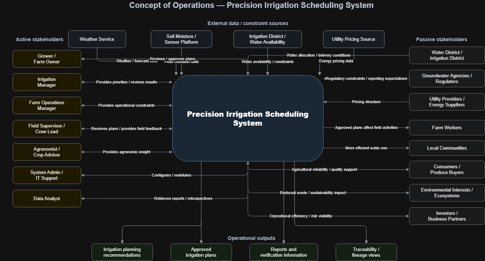

## 5.4 System Context

The system context for the proposed concept is focused on direct users, external information sources, and external constraint-setting entities that interact with the proposed system during normal operation. It is not intended to show every stakeholder affected by irrigation outcomes. The proposed system interacts directly with farm-side users who provide planning inputs, review alternative scenarios, refine recommendations, and approve irrigation plans. It also relies on external sources of operational information and constraints, including weather data services, field and equipment monitoring systems, utility pricing inputs, and water-delivery or regulatory constraints imposed by irrigation districts and groundwater agencies. Broader stakeholders such as local communities, consumers, environmental interests, and investors remain important in the stakeholder analysis, but they are not modeled here as direct system interfaces because they do not normally exchange operational data, constraints, or planning information with the system.

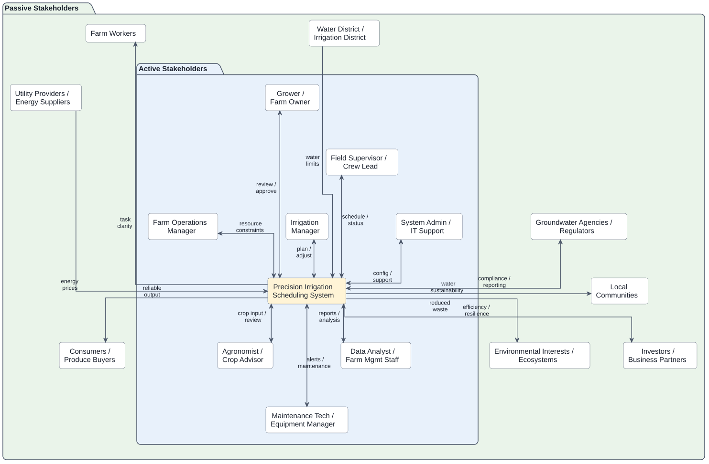

## 5.5 “To Be” Operational Scenarios

### Scenario 1: Normal Weekly Irrigation Planning Under Standard Conditions

At the start of the planning period, the **irrigation manager** opens the Precision Irrigation Scheduling System to prepare the irrigation plan for the coming week. The system has already ingested recent weather forecasts, irrigation history, field and zone data, crop growth stage information, and available operational constraints such as pump capacity and expected labor availability. The irrigation manager reviews the current field conditions and requests scenario generation for the next seven days.

The system evaluates expected crop water demand by field or irrigation zone and generates several feasible irrigation scenarios. One scenario prioritizes minimizing pumping cost by shifting irrigation toward lower-cost energy periods, another prioritizes maintaining uniform crop water status across all high-value blocks, and a third balances water use efficiency with operational simplicity. For each scenario, the system displays recommended irrigation timing, application amount, expected water use, estimated pumping cost, and the main factors driving the recommendation.

The irrigation manager compares the scenarios and selects the one that best fits current operational priorities. The selected plan is then reviewed by the **grower or farm owner**, who approves it after checking the tradeoffs and expected outcomes. The system records the approved schedule and makes it available to the **field supervisor / crew lead** for execution planning.

This scenario demonstrates the core contribution of the system under routine conditions. Instead of relying on disconnected tools and informal judgment, users receive integrated, explainable, and feasible planning alternatives that improve consistency and decision quality.

### Scenario 2: Restricted Water Supply and Prioritization During a Shortage Period

Midway through the irrigation season, the farm receives notice that water availability will be more limited than expected for the next planning period. The **irrigation manager** and **grower** must decide how to allocate scarce water across multiple fields with different crop sensitivities, economic value, and current moisture conditions. In the current state, this decision would depend heavily on manual estimation and experience. In the proposed system, the user enters the new water availability constraint and requests a shortage planning analysis.

The Precision Irrigation Scheduling System updates its planning assumptions and generates multiple constrained irrigation scenarios. One scenario protects the most water-sensitive orchard blocks first, another preserves the largest expected economic return, and a third spreads reduced irrigation more evenly across the farm to avoid severe stress in any single area. The system clearly shows the tradeoffs among the alternatives, including estimated water savings, predicted crop stress risk, likely pumping demand, and fields or zones expected to be deferred.

The **agronomist / crop advisor** reviews the scenario summaries and provides input on crop sensitivity and acceptable stress thresholds. The **farm operations manager** checks whether the preferred scenario can be executed with available crews and equipment. After comparing the options, the **grower** approves a scenario that protects the highest-priority fields while accepting moderate stress in less sensitive blocks.

The system logs the selected plan, documents the rationale for the decision, and provides a clear record of which fields were prioritized and why. This scenario illustrates one of the main reasons for selecting the proposed concept: the system does not only generate a schedule, but helps users compare feasible alternatives under uncertainty and scarcity.

### Scenario 3: Support and Maintenance Response to Missing Sensor Data and Equipment Issues

During an active irrigation period, the system detects that one field’s soil moisture sensor feed has stopped updating and that a connected pump-monitoring source is showing abnormal runtime behavior. The Precision Irrigation Scheduling System flags the issue and alerts the **maintenance technician / equipment manager** and the **system administrator / IT support**. At the same time, the system marks the affected data source as degraded and adjusts its confidence in recommendations for the impacted field.

Rather than failing completely, the system continues operating using fallback inputs such as recent irrigation history, weather data, crop profile information, and available manual observations. It identifies which recommended schedules are affected by the missing or unreliable data and notifies the **irrigation manager** that a recommendation should be reviewed before execution. The maintenance technician investigates the pump or monitoring issue, while IT support checks the sensor data connection and confirms whether the outage is caused by communications failure, sensor malfunction, or data integration error.

Once the issue is resolved, the system resumes normal data ingestion, updates the affected field status, and regenerates the impacted recommendations. It also records the event, the duration of degraded operation, and any user overrides made during the interruption.

This support scenario shows that the proposed system contributes not only during normal planning, but also during partial failure or degraded conditions. It supports continued operations, alerts the right support personnel, and preserves reliability and traceability even when parts of the data environment are unavailable.

## 5.6 Use Case Model

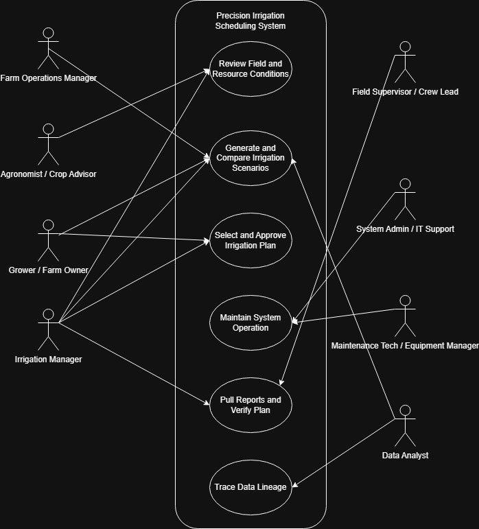

| ID    | Use Case                                      | Why It Is Important                                                                                                        | Main Actors Involved                                                           | What Happens in This Use Case                                                                                                                |
| ----- | --------------------------------------------- | -------------------------------------------------------------------------------------------------------------------------- | ------------------------------------------------------------------------------ | -------------------------------------------------------------------------------------------------------------------------------------------- |
| UC-01 | **Generate and Compare Irrigation Scenarios** | This is the core function of the proposed system and the feature that most distinguishes it from a simple scheduling tool. | Irrigation Manager, Grower / Farm Owner, Farm Operations Manager, Data Analyst | The system generates alternative irrigation plans under current conditions and constraints so users can compare options before choosing one. |
| UC-02 | **Select and Approve Irrigation Plan**        | This is the main decision point where users turn analysis into an actionable plan.                                         | Irrigation Manager, Grower / Farm Owner                                        | Users review candidate scenarios and choose the plan that best balances crop needs, operational feasibility, and resource constraints.       |
| UC-03 | **Review Field and Resource Conditions**      | This use case provides the situational awareness needed before planning can occur.                                         | Irrigation Manager, Agronomist / Crop Advisor                                  | Users review field conditions, crop status, and available resources before generating irrigation scenarios.                                  |
| UC-04 | **Maintain System Operation**                 | This is the support and maintenance use case that keeps the system usable and reliable over time.                          | System Admin / IT Support, Maintenance Tech / Equipment Manager                | Support personnel review system status, address configuration or integration issues, and keep the system functioning properly.               |
| UC-05 | **Pull Reports and Verify Plan**              | This use case supports operational review, validation, and confirmation that the selected plan is ready and defensible.    | Irrigation Manager, Field Supervisor / Crew Lead                               | Users retrieve plan summaries, reports, or supporting information and verify that the approved irrigation plan is operationally clear and feasible for field execution.                           |
| UC-06 | **Trace Data Lineage**                        | This use case supports transparency, auditability, and understanding of how data contributes to outputs.                   | Data Analyst                                                                   | The user traces the origin and flow of relevant data used by the system to support analysis, reporting, or verification.                     |

## 5.7 Use Case Specifications

### 5.7.1 UC-01

This sequence diagram describes the operational version of UC-01: Generate and Compare Irrigation Scenarios. The Irrigation Manager initiates scenario generation, and the system retrieves previously stored farm and planning information from internal records so that other authorized users, such as the Farm Operations Manager and Grower / Farm Owner, can review or update relevant constraints and priorities without needing to participate simultaneously. The system then gathers current external information from weather services, soil moisture sensors, the irrigation district, and utility pricing data before generating multiple irrigation scenarios. These results allow users to compare tradeoffs in water use, timing, operational feasibility, and cost before revising inputs or proceeding to plan selection.

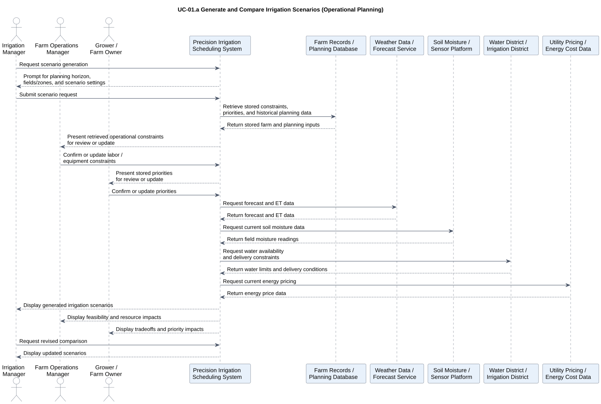

This sequence diagram describes an independent analytical version of UC-01 used for ad hoc historical review or retrospective analysis. In this case, the Data Analyst requests scenario analysis for a selected historical period, and the system retrieves stored planning records along with historical weather, field, water-constraint, and energy-cost data. Using those records, the system reconstructs or compares prior irrigation scenarios and presents the results for review. This supports reporting, retrospective evaluation, and deeper analysis without placing the Data Analyst inside the live operational planning workflow.

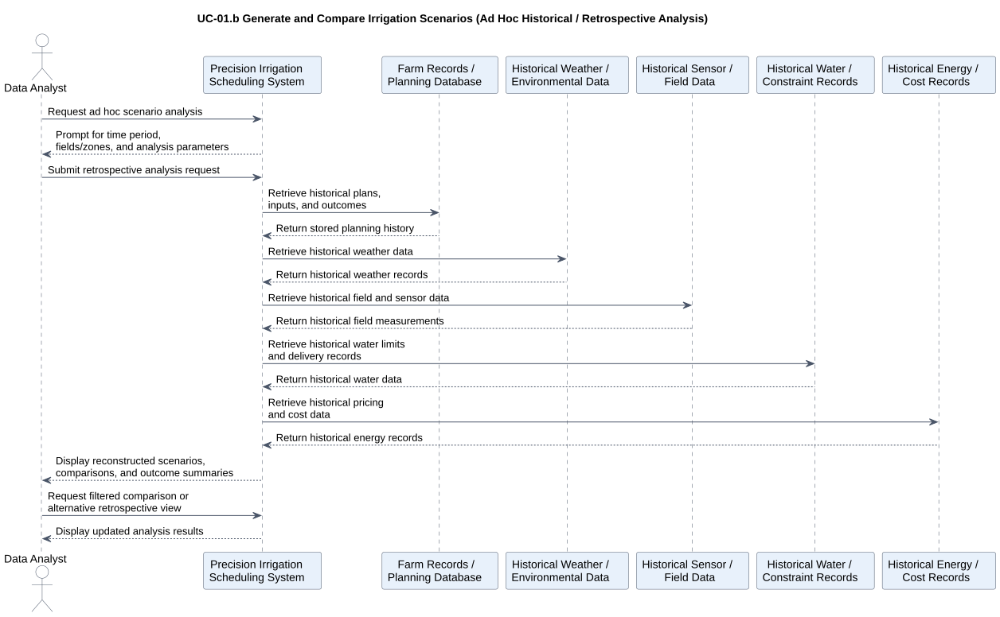

### 5.7.2 UC-02

This sequence diagram describes how the system supports UC-02: Select and Approve Irrigation Plan. The Irrigation Manager retrieves and reviews previously generated irrigation scenarios, selects a preferred plan, and submits it to the Grower / Farm Owner for approval. The system presents the selected plan with its key tradeoffs, including timing, water use, resource impacts, and planning priorities, so the approver can make a defensible decision. Once the plan is approved, the system stores the approval decision, selected plan, approver identity, timestamp, and updated plan status in the planning database so the outcome can be traced, reported, and verified later.

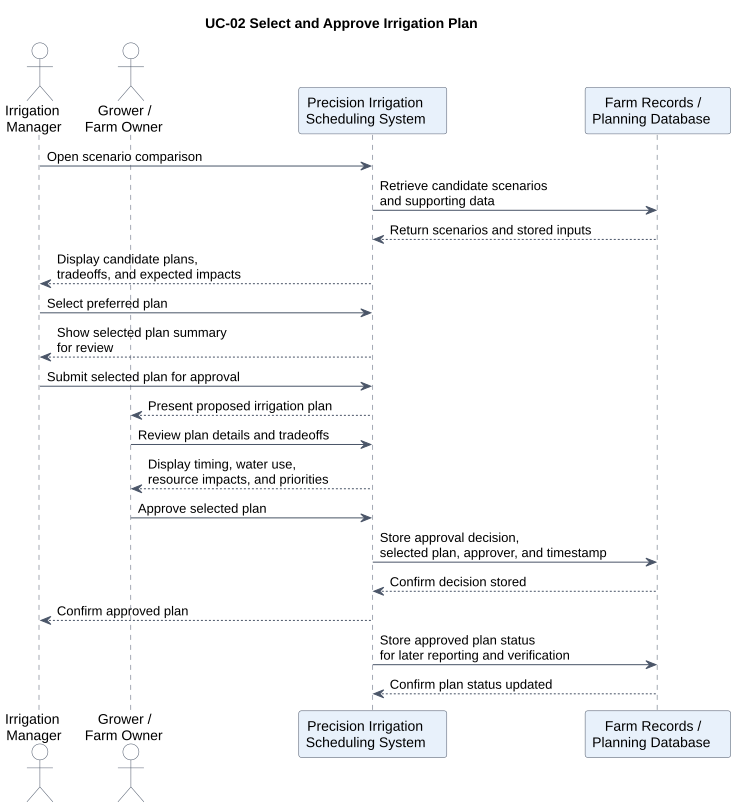

### 5.7.3 UC-03

This sequence diagram describes how the system supports UC-03: Review Field and Resource Conditions. The Irrigation Manager begins by opening the review function, and the system retrieves stored field, crop, and planning information from internal records while also gathering current external information from weather services, soil moisture sensors, the irrigation district, and utility pricing data. The resulting combined view allows the manager to assess current conditions, resource limits, and any relevant alerts before planning begins. The Agronomist / Crop Advisor can independently review the condition summary and add advisory notes or concerns, which the system stores and then presents back to the Irrigation Manager so those inputs can be incorporated into later scenario generation and decision-making.

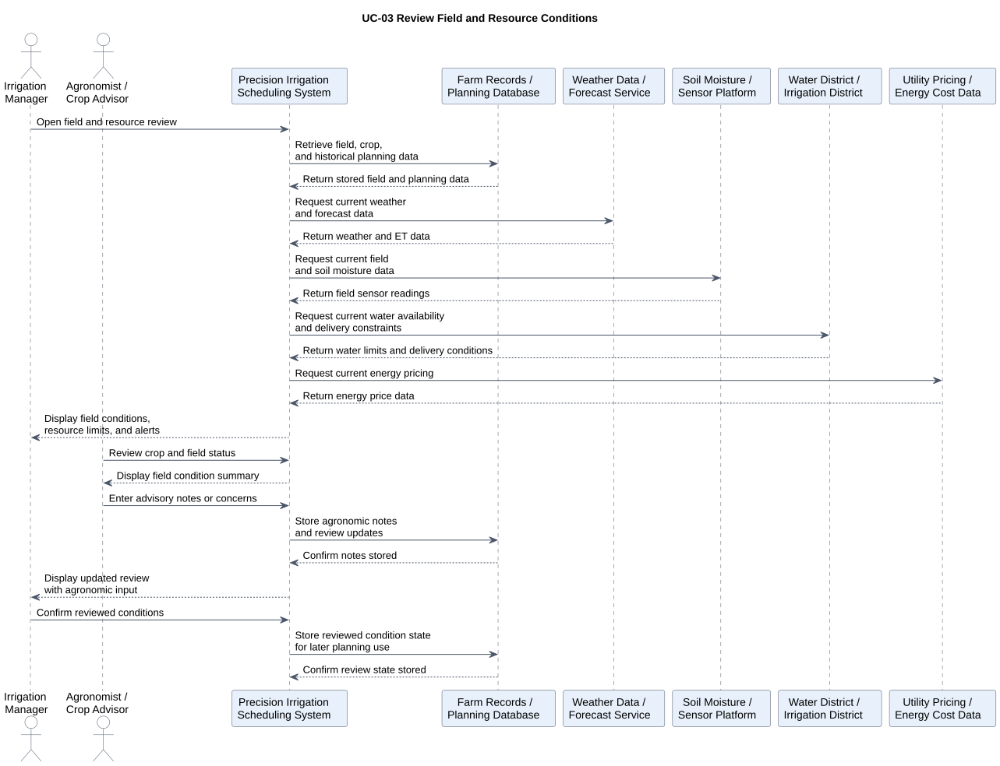

### 5.7.4 UC-04

This sequence diagram describes how the system supports UC-04: Maintain System Operation. The System Admin / IT Support actor reviews system status, configuration state, alert history, and integration health, while the Maintenance Tech / Equipment Manager reviews equipment- or connection-related alerts that may affect reliable operation. The system checks relevant external interfaces such as the soil sensor platform, irrigation district data feed, and utility pricing feed to determine whether integrations are healthy or degraded. When corrective actions are taken, the system stores configuration changes, maintenance actions, operator identity, and timestamps in the planning database so system status changes remain traceable and auditable over time.

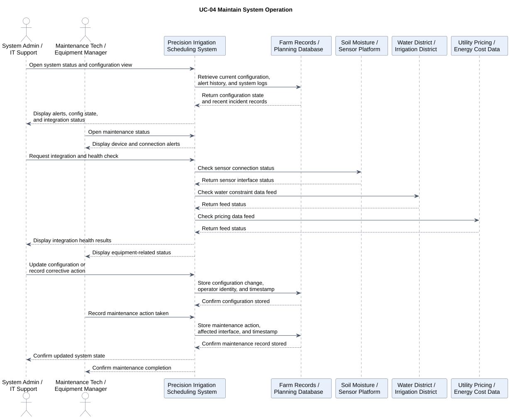

### 5.7.5 UC-05

This sequence diagram describes how the system supports UC-05: Pull Reports and Verify Plan. The Irrigation Manager requests the approved plan report, and the system retrieves the selected plan, supporting scenario information, and stored decision records from the planning database. The Field Supervisor / Crew Lead then reviews the approved plan from an execution perspective, using the report and plan details to verify that the schedule is understandable and feasible for field operations. Any verification feedback or execution concerns are stored by the system, and the resulting verified plan status is recorded so the decision can be reviewed, reported, and traced later.

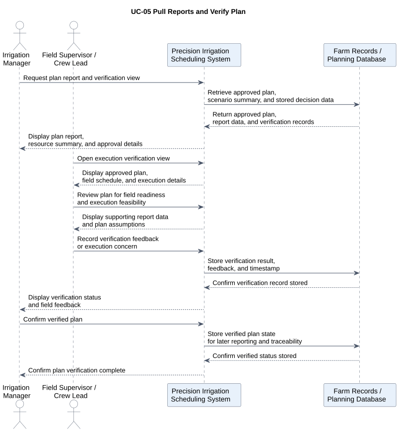

### 5.7.6 UC-06

This sequence diagram describes how the system supports UC-06: Trace Data Lineage. The Data Analyst initiates a lineage query by selecting a dataset, field or zone, time period, or specific plan or report reference. The system then retrieves stored lineage records, user-entered inputs, timestamps, and source references from internal records, while also obtaining relevant metadata from external sources such as weather services, sensor platforms, the irrigation district, and utility pricing feeds. The resulting lineage view allows the analyst to determine where required data originated, when it was captured or updated, how frequently it was refreshed, and how those inputs contributed to later plans, reports, or decisions.

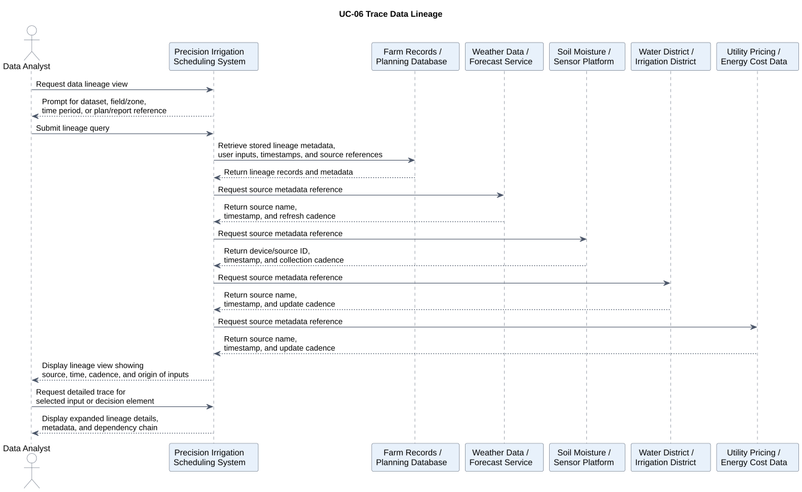

## 5.8 QFD Analysis

The QFD analysis was used to translate key stakeholder characteristics into system-level objectives for the proposed precision irrigation scheduling system. The WHAT rows capture the most important stakeholder concerns identified earlier, including usability, responsiveness, reliability, trustworthiness, explainability, and maintainability, each decomposed into more specific sub-characteristics. The HOW columns represent the main system objectives that respond to those concerns, such as data integration, scenario generation, constraint modeling, reporting, lineage tracking, degraded-mode handling, and configuration management. The resulting relationships show that the most important stakeholder concerns are supported by a combination of analytical capability, traceability features, and operational support functions. The attic correlations are also reasonable because they highlight where system objectives reinforce one another, such as the relationship between historical record storage and lineage tracking, while also acknowledging limited tradeoffs where additional tracking or storage can introduce complexity or overhead.

### 5.8.1 QFD Matrix

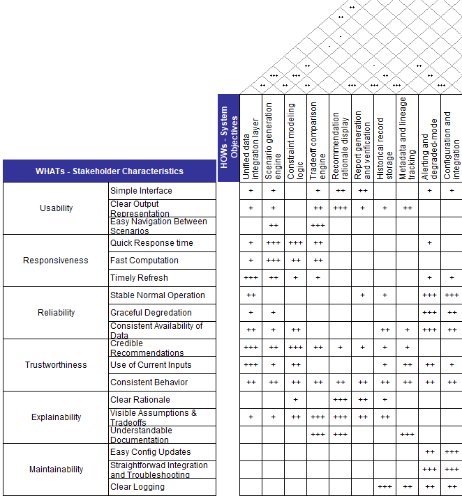

The body of the QFD matrix shows how each system objective contributes to satisfying the identified stakeholder characteristics. Several of the strongest positive relationships are concentrated where the connection between stakeholder concern and design response is especially direct. For example, **Recommendation Rationale Display** has a strong relationship with the explainability-related rows, especially **Clear Rationale** and **Visible Assumptions and Tradeoffs**, because making the logic, assumptions, and comparisons visible is central to helping users understand why the system produced a recommendation. Similarly, **Constraint Modeling Logic** and **Unified Data Integration Layer** are strongly related to **Credible Recommendations** and **Use of Current Inputs** under trustworthiness, since users are more likely to trust the output when it is based on current, integrated data and realistic operational constraints. Strong correlations also appear between **Alerting and Degraded-Mode Handling** and the reliability and maintainability rows, because reliable operation and maintainable support both depend on the system being able to detect problems, communicate them clearly, and continue operating when some inputs or integrations are degraded. Other highlighted relationships in the body reflect the system’s broader operational and traceability goals. **Report Generation and Verification**, **Historical Record Storage**, and **Metadata and Lineage Tracking** all show meaningful support for explainability and maintainability because reports, stored records, and lineage information help users verify plans, understand documentation, and review what changed over time. 

The body of the QFD matrix is mostly positive because the selected HOWs were defined as system objectives intended to support stakeholder-valued WHATs. That said, negative relationships could exist in principle. For example, a WHAT such as Usability, especially Simple Interface, could be weakly at odds with a HOW such as Metadata and Lineage Tracking if too much provenance detail were exposed directly in the main interface, and a WHAT such as Responsiveness could be weakly at odds with Historical Record Storage or Lineage Tracking if additional storage and audit functionality introduced processing overhead. These kinds of tensions were not represented as negative body relationships because the design assumption is that they can be mitigated through implementation choices, such as placing detailed lineage information in drill-down views or optimizing storage and retrieval performance. As a result, the body emphasizes the intended supportive role of each HOW, while the more significant tradeoffs between design objectives are represented in the attic.

The strongest positive correlations in the attic reflect system objectives that naturally reinforce one another. For example, the correlation between **Scenario Generation Engine** and **Tradeoff Comparison Engine** is strong because meaningful tradeoff analysis depends on the system’s ability to produce multiple feasible irrigation scenarios for comparison. Likewise, **Historical Record Storage** and **Metadata and Lineage Tracking** are strongly correlated because lineage is only useful when the underlying historical plans, inputs, approvals, and timestamps are preserved. Another strong positive relationship appears between **Alerting and Degraded-Mode Handling** and **Configuration and Integration Management**, since the system’s ability to detect failures and continue operating in a degraded state depends heavily on well-managed configurations and properly maintained external interfaces.

One weak negative correlation appears between the **Scenario Generation Engine** and **Historical Record Storage**. This negative relationship is reasonable because richer storage of historical data and more extensive recordkeeping can introduce additional retrieval and processing overhead, which may slightly reduce computational efficiency during scenario generation. The conflict is weak rather than strong because the two objectives are still broadly compatible; the issue is not that they oppose each other conceptually, but that increasing one may impose some performance or complexity costs on the other.

## 5.9 System Requirements

The system requirements were written to be traceable, testable, and scoped to the proposed system boundary. Each requirement maps to one or more use cases so that the requirements remain grounded in specific system interactions rather than abstract goals. Functional requirements trace directly to the operational use cases, such as scenario generation, plan approval, reporting, maintenance, and lineage review, while nonfunctional requirements constrain the performance or quality of those same interactions. Support, interface, data, and security requirements were also tied to the relevant use cases so that every requirement can be justified by a concrete user or support activity. In addition, the requirements were written as singular “shall” statements to improve clarity and verifiability, avoiding unnecessary bundling of multiple obligations into one row. This makes each requirement easier to inspect, demonstrate, analyze, or test, and helps ensure that the set as a whole reflects good systems-engineering practice by being specific, implementable, traceable to stakeholder needs and use cases, and capable of objective verification.

| Requirement Number | Requirement Type      | System Requirement                                                                                                                   | Traceability                                                                                                                            | Verification              |
| ------------------ | --------------------- | ------------------------------------------------------------------------------------------------------------------------------------ | --------------------------------------------------------------------------------------------------------------------------------------- | ------------------------- |
| SR-001             | Functional            | The system shall allow an authorized user to review current field conditions before generating an irrigation scenario.               | Stakeholders: Irrigation Manager, Agronomist / UC-03 / QFD: Trustworthiness, Explainability                                             | Demonstration, Inspection |
| SR-002             | Functional            | The system shall allow an authorized user to review current resource conditions before generating an irrigation scenario.            | Stakeholders: Irrigation Manager / UC-03 / QFD: Trustworthiness                                                                         | Demonstration, Inspection |
| SR-003             | Functional            | The system shall generate multiple irrigation scenarios for a user-selected planning horizon.                                        | Stakeholders: Irrigation Manager, Farm Operations Manager / UC-01 / QFD: Responsiveness, Trustworthiness / AC-1                         | Test, Analysis            |
| SR-004             | Functional            | The system shall apply operational constraints during irrigation scenario generation.                                                | Stakeholders: Irrigation Manager, Farm Operations Manager / UC-01 / QFD: Trustworthiness, Reliability / AC-3                            | Test, Analysis            |
| SR-005             | Functional            | The system shall display tradeoff information for each generated irrigation scenario.                                                | Stakeholders: Irrigation Manager, Grower / UC-01 / QFD: Explainability, Usability / AC-4                                                | Demonstration, Inspection |
| SR-006             | Functional            | The system shall allow an authorized user to select an irrigation scenario for approval.                                             | Stakeholders: Irrigation Manager, Grower / UC-02 / QFD: Usability, Explainability                                                       | Demonstration, Test       |
| SR-007             | Data                  | The system shall store the approval decision for a selected irrigation plan.                                                         | Stakeholders: Grower, Irrigation Manager / UC-02 / QFD: Maintainability, Explainability                                                 | Test, Inspection          |
| SR-008             | Data                  | The system shall store the approver identity and approval timestamp for a selected irrigation plan.                                  | Stakeholders: Grower, Irrigation Manager / UC-02 / QFD: Maintainability, Explainability                                                 | Test, Inspection          |
| SR-009             | Functional            | The system shall allow an authorized user to retrieve a report for an approved irrigation plan.                                      | Stakeholders: Irrigation Manager, Field Supervisor / UC-05 / QFD: Explainability, Usability                                             | Demonstration, Inspection |
| SR-010             | Data                  | The system shall provide lineage information for stored plans, reports, and planning inputs.                                         | Stakeholders: Data Analyst / UC-06 / QFD: Explainability, Trustworthiness, Maintainability                                              | Demonstration, Inspection |
| SR-011             | Nonfunctional         | The system shall generate an irrigation scenario set within 5 minutes under nominal operating conditions.                            | Stakeholders: Irrigation Manager / UC-01 / QFD: Responsiveness / AC-1                                                                   | Test                      |
| SR-012             | Nonfunctional         | The system shall update affected recommendations within 10 minutes of a significant input change under nominal operating conditions. | Stakeholders: Irrigation Manager / UC-01, UC-03 / QFD: Responsiveness / AC-2                                                            | Test                      |
| SR-013             | Interface             | The system shall retrieve planning data from external sources when such data is available.                                           | Stakeholders: Irrigation Manager, Agronomist / UC-01, UC-03 / QFD: Trustworthiness, Reliability                                         | Test, Demonstration       |
| SR-014             | Support / Maintenance | The system shall provide authorized support users with access to system status and integration health information.                   | Stakeholders: System Admin / IT Support, Maintenance Tech / UC-04 / QFD: Reliability, Maintainability                                   | Demonstration, Inspection |
| SR-015             | Security              | The system shall restrict approval, maintenance, reporting, and lineage functions based on user role.                                | Stakeholders: Grower, Irrigation Manager, IT Support, Data Analyst / UC-02, UC-04, UC-05, UC-06 / QFD: Trustworthiness, Maintainability | Test, Inspection          |

# 6. Functional and Physical Architecture

## 6.1 Input/Output Matrices

This input/output matrix organizes the system’s major inputs and outputs into four categories: data, operational, human, and environmental. The intended inputs are the information, constraints, and user actions the system is expected to receive in order to support irrigation planning and review. The unintended inputs are disruptive or external influences, such as missing data, degraded infrastructure, staffing problems, and unusual environmental conditions, that can affect system performance even though they are not deliberately provided. The desired outputs are the useful results the system is designed to produce, including scenarios, approved plans, reports, reviews, and stored records. The undesired outputs are potential negative consequences, such as stale information, infeasible plans, coordination problems, or degraded recommendation quality, which should be anticipated and minimized through design.

| Category          | Inputs – Intended                                                                                                               | Inputs – Unintended                                                                                                              | Outputs – Desired                                                                                            | Outputs – Undesired                                                                                                       |
| ----------------- | ------------------------------------------------------------------------------------------------------------------------------- | -------------------------------------------------------------------------------------------------------------------------------- | ------------------------------------------------------------------------------------------------------------ | ------------------------------------------------------------------------------------------------------------------------- |
| **Data**          | Weather data, soil moisture data, crop records, field maps, irrigation history, water availability data, energy pricing data    | Missing sensor data, stale forecasts, delayed district updates, inconsistent timestamps, incomplete records                      | Integrated planning data, condition summaries, scenario inputs, historical records, lineage information      | Stale data in planning view, incomplete records, inconsistent data versions, misleading input picture                     |
| **Operational**   | Planning horizon, selected fields/zones, labor limits, equipment limits, delivery windows, user-defined constraints             | Pump failures, infrastructure limitations, unexpected labor shortages, communication delays, rapidly changing supply conditions  | Feasible irrigation scenarios, approved plans, verification reports, maintenance status information          | Unrealistic schedules, delayed approvals, infeasible plans, degraded operational coordination                             |
| **Human**         | User-entered priorities, approval decisions, agronomic notes, verification feedback, maintenance actions, configuration updates | Incorrect manual inputs, user misunderstanding, delayed review, conflicting stakeholder priorities, unauthorized access attempts | Approved plan decisions, stored approvals, review notes, verification records, corrective action logs        | Input errors, approval bottlenecks, poor traceability of decisions, user confusion, inconsistent plan interpretation      |
| **Environmental** | Normal field conditions, expected weather variation, seasonal crop conditions, normal water supply conditions                   | Extreme heat, unexpected rainfall, drought restrictions, poor connectivity, sensor degradation, unusual field conditions         | Adaptive recommendations, updated scenarios, alerts on changing conditions, field/resource condition reviews | Overreaction to noisy conditions, missed updates, alert fatigue, reduced recommendation quality under degraded conditions |

This next version of the input/output matrix organizes the system by major operational functions: planning, approval/decision, execution/verification, maintenance/support, and reporting/traceability. Intended inputs represent the information, constraints, and user actions required for each activity, while unintended inputs capture disruptions or conditions outside the system’s direct control that can affect performance. Desired outputs are the useful products the system should generate in each area, such as scenarios, approvals, verification records, maintenance status, and lineage views. Undesired outputs represent foreseeable negative results, such as unrealistic scenarios, approval delays, incomplete traceability, or degraded operation, which should be identified early and reduced through system design.

| Category                     | Inputs – Intended                                                                                                                                   | Inputs – Unintended                                                                                                      | Outputs – Desired                                                                                        | Outputs – Undesired                                                                                      |
| ---------------------------- | --------------------------------------------------------------------------------------------------------------------------------------------------- | ------------------------------------------------------------------------------------------------------------------------ | -------------------------------------------------------------------------------------------------------- | -------------------------------------------------------------------------------------------------------- |
| **Planning**                 | Planning horizon, selected fields/zones, weather data, soil moisture data, crop data, water constraints, labor and equipment limits, energy pricing | Stale forecasts, missing sensor data, conflicting constraints, rapidly changing water availability, poor input quality   | Feasible irrigation scenarios, tradeoff comparisons, prioritized alternatives, updated recommendations   | Unrealistic scenarios, incomplete comparisons, delayed planning outputs, misleading prioritization       |
| **Approval / Decision**      | Selected scenario, approval request, user roles, stored priorities, supporting tradeoff information                                                 | Delayed decision-making, ambiguous scenario differences, missing approval context, conflicting stakeholder preferences   | Approved irrigation plan, stored approval decision, approver identity, timestamped decision record       | Approval bottlenecks, suboptimal plan selection, unauthorized approval, incomplete decision traceability |
| **Execution / Verification** | Approved plan, execution details, report request, field feedback, verification input                                                                | Miscommunication, field-readiness issues, outdated plan information, connectivity limitations in the field               | Verification report, execution-readiness confirmation, stored verification feedback, plan review summary | Execution confusion, unverifiable plan, outdated reports, extra manual coordination effort               |
| **Maintenance / Support**    | System status request, alert data, integration health data, maintenance actions, configuration updates                                              | API outages, sensor failures, district feed failures, software misconfiguration, network instability                     | Health status view, maintenance records, restored configurations, corrected integration state            | Prolonged degraded operation, silent failures, unresolved alerts, incorrect support actions              |
| **Reporting / Traceability** | Historical plans, stored reports, source metadata, timestamps, lineage query, historical field and planning records                                 | Missing metadata, inconsistent timestamps, incomplete source history, record corruption, changed external source formats | Historical summaries, lineage views, provenance traces, auditable planning and decision history          | Incomplete lineage, hard-to-interpret provenance, missing records, weak retrospective accountability     |

## 6.2 First Level Decomposition

This first-level functional decomposition organizes the proposed system into its main mission-oriented functions. Acquire and Manage Planning Data captures the collection and organization of the data needed for planning. Assess Field and Resource Conditions represents evaluation of the current agricultural and operational state before decisions are made. Generate and Compare Irrigation Scenarios is the core analytical function, where feasible alternatives are produced and evaluated. Select and Approve Irrigation Plans represents the human decision and approval step that turns analysis into an actionable plan. Generate Reports and Verify Plans covers reporting and operational confirmation of approved outputs, while Trace Data Lineage ensures that plans, reports, and decisions can be linked back to their underlying inputs and metadata. Together, these functions describe the major internal responsibilities of the system at a high level without yet decomposing them into lower-level subfunctions.

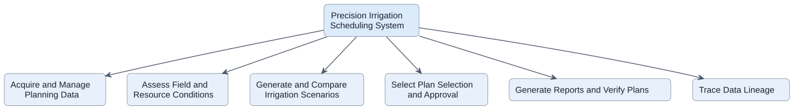

## 6.3 IDEF0 Model

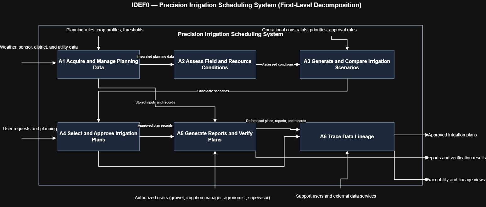

The first-level IDEF0 decomposition identifies the main functional nodes of the proposed system along with their major inputs, controls, outputs, mechanisms, and internal flows. The most important external inputs are the environmental and operational data sources the system depends on, such as weather data, sensor data, irrigation district information, utility pricing data, and stored farm records. The main controls are the rules, priorities, and policies that govern system behavior, including planning rules, crop profiles, thresholds, operational constraints, approval rules, reporting criteria, and lineage rules. The principal external outputs are the products the system provides to users, namely approved irrigation plans, reports and verification results, and traceability or lineage views. Together, these elements show how data enters the system, how it is governed and transformed by internal functions, and how the resulting planning and accountability outputs are produced.

| Node                                               | Input                                                                                   | Control                                                                                               | Output                                                                            | Mechanism                                                        | Flows Between                                                                                                                                                                                                                          |
| -------------------------------------------------- | --------------------------------------------------------------------------------------- | ----------------------------------------------------------------------------------------------------- | --------------------------------------------------------------------------------- | ---------------------------------------------------------------- | -------------------------------------------------------------------------------------------------------------------------------------------------------------------------------------------------------------------------------------- |
| **A1 — Acquire and Manage Planning Data**          | Weather data, sensor data, irrigation district data, utility pricing data, farm records | Planning rules, crop profiles, thresholds, data validation rules                                      | Integrated planning data, stored inputs and records, validated source data        | Data services, APIs, databases, ingestion/configuration services | Sends **integrated planning data** to **A2**; sends **stored inputs and records** to **A5**                                                                                                                                            |
| **A2 — Assess Field and Resource Conditions**      | Integrated planning data from A1                                                        | Assessment rules, agronomic logic, field evaluation criteria                                          | Assessed conditions, field/resource condition summaries, planning-relevant alerts | Irrigation manager, agronomist, assessment logic                 | Receives **integrated planning data** from **A1**; sends **assessed conditions** to **A3**                                                                                                                                             |
| **A3 — Generate and Compare Irrigation Scenarios** | Assessed conditions from A2                                                             | Operational constraints, priorities, approval rules, water availability assumptions, cost assumptions | Candidate scenarios, tradeoff comparisons, ranked feasible alternatives           | Scenario engine, comparison logic, irrigation manager, grower    | Receives **assessed conditions** from **A2**; sends **candidate scenarios** to **A4**                                                                                                                                                  |
| **A4 — Select and Approve Irrigation Plans**       | Candidate scenarios from A3                                                             | Approval policy, user authority, management priorities                                                | Approved irrigation plans, approval decision records                              | Grower / farm owner, irrigation manager                          | Receives **candidate scenarios** from **A3**; sends **approved plan and decision record** to **A5**; can output **approved irrigation plans** externally                                                                               |
| **A5 — Generate Reports and Verify Plans**         | Approved plan and decision record from A4; stored inputs and records from A1            | Reporting rules, verification criteria, report templates                                              | Reports, verification results, plan review summaries                              | Irrigation manager, field supervisor / crew lead                 | Receives **approved plan and decision record** from **A4**; receives **stored inputs and records** from **A1**; sends **referenced plans, reports, and records** to **A6**; can output **reports and verification results** externally |
| **A6 — Trace Data Lineage**                        | Referenced plans, reports, and records from A5                                          | Lineage rules, metadata model, audit/query rules                                                      | Traceability views, lineage views, provenance summaries                           | Data analyst, support users, metadata services                   | Receives **referenced plans, reports, and records** from **A5**; can output **traceability and lineage views** externally                                                                                                              |

# 7. Risk Assessment

The most critical performance requirements for the proposed precision irrigation scheduling system are those that determine whether the system is useful in real farm operations, produces feasible outputs, and preserves the accountability needed for later review. In particular, the system must generate irrigation scenarios quickly enough to support planning, update recommendations when important inputs change, produce scenarios that remain feasible under water and operational constraints, and preserve the records needed for approval, reporting, and lineage review. These performance needs are central because failure in any one of them would directly reduce the value of the system to its primary stakeholders, especially irrigation managers, growers, analysts, and support personnel.

From these requirements, a small set of Technical Performance Measures (TPMs) can be derived to monitor whether the system is meeting its intended operational objectives. The TPMs below were selected because they correspond to the most important failure modes: planning outputs arriving too slowly, recommendations becoming stale, generated scenarios becoming infeasible, and records becoming too incomplete for later verification or traceability. Together, they provide a practical basis for monitoring technical performance while keeping the analysis focused on the highest-value measures.

## 7.1 Technical Performance Measures

| TPM ID | Technical Performance Measure | Related Requirement / Use Case       | Failure Mode Monitored                                                             | Measure / Target                                                                                                              |
| ------ | ----------------------------- | ------------------------------------ | ---------------------------------------------------------------------------------- | ----------------------------------------------------------------------------------------------------------------------------- |
| TPM-1  | Scenario generation time      | SR-002, SR-009 / UC-01               | Scenario generation is too slow for operational planning                           | Generate irrigation scenario set within **5 minutes** under nominal conditions                                                |
| TPM-2  | Recommendation update latency | SR-010 / UC-01, UC-03                | Recommendations remain stale after significant input changes                       | Update affected recommendations within **10 minutes** of a significant weather, soil moisture, or water-availability change   |
| TPM-3  | Constraint-compliance rate    | SR-003 / UC-01, UC-02                | Generated or selected plans violate water, labor, equipment, or energy constraints | Generated scenarios remain feasible with respect to defined operational constraints                                           |
| TPM-4  | Traceability completeness     | SR-006, SR-008 / UC-02, UC-05, UC-06 | Approval decisions, reports, or data sources cannot be fully reconstructed later   | Approved plans and related records retain approver, timestamp, and source metadata needed for verification and lineage review |

These TPMs focus on the technical areas most likely to determine whether the system succeeds in practice. TPM-1 and TPM-2 capture whether the system is fast enough and adaptive enough to support real planning decisions. TPM-3 evaluates whether the analytical outputs remain grounded in operational reality rather than producing scenarios that cannot actually be executed. TPM-4 addresses accountability and transparency by ensuring that plans, approvals, reports, and source data can be reconstructed later for verification and retrospective analysis.

## 7.2 Risk Management Plan

| Risk ID | Risk Description                                                                                             | Related Requirement / Use Case       | Primary Stakeholder       | Potential Impact                                                                           | Mitigation Plan                                                                                                                                                              |
| ------- | ------------------------------------------------------------------------------------------------------------ | ------------------------------------ | ------------------------- | ------------------------------------------------------------------------------------------ | ---------------------------------------------------------------------------------------------------------------------------------------------------------------------------- |
| R-1     | External data feeds are unavailable, delayed, or inconsistent                                                | SR-011, SR-012 / UC-01, UC-03, UC-04 | Irrigation Manager        | Scenario quality degrades, recommendations become stale, or planning is delayed            | Design degraded-mode operation using stored or alternate inputs, monitor feed health, log feed failures, and alert support users when external interfaces become unavailable |
| R-2     | Generated scenarios are not operationally feasible because constraints are incomplete or modeled incorrectly | SR-003 / UC-01, UC-02                | Farm Operations Manager   | Users may receive unrealistic plans that cannot be executed in practice                    | Validate constraint models using realistic farm cases, require review of stored constraints before scenario generation, and monitor constraint-compliance rate through TPM-3 |
| R-3     | Users do not trust or adopt system recommendations because outputs are insufficiently explained              | SR-004 / UC-01, UC-02, UC-05         | Grower / Farm Owner       | Low adoption, workarounds, and continued reliance on manual methods                        | Require rationale display and tradeoff summaries, include explanation in review workflows, and evaluate outputs with representative users during development                 |
| R-4     | Decision, approval, or lineage records are incomplete or inconsistent                                        | SR-006, SR-008 / UC-02, UC-05, UC-06 | Data Analyst              | Plans cannot be fully verified, reconstructed, or audited later                            | Store approval metadata automatically, enforce required record fields, validate lineage outputs during testing, and monitor traceability completeness through TPM-4          |
| R-5     | Configuration errors or integration changes degrade system behavior over time                                | SR-013, SR-014 / UC-04               | System Admin / IT Support | System reliability decreases, support burden rises, and failures become harder to diagnose | Provide configuration visibility, log system and integration changes, maintain maintenance records, and use controlled update procedures for interfaces and settings         |

The most significant risks for this concept are tied to external dependencies, output feasibility, user trust, and record completeness. Because the system depends on weather data, sensor platforms, irrigation district information, and pricing inputs, external feed reliability is a major technical risk and must be mitigated through degraded-mode behavior and strong monitoring. A second major risk is that even analytically valid scenarios may fail if operational constraints are incomplete or poorly modeled, which is why feasibility must be treated as both a design concern and a measurable performance concern.

User trust and traceability are also critical. If stakeholders cannot understand why a recommendation was produced, they may reject the system regardless of its analytical quality. Likewise, if the system cannot preserve approval decisions, supporting records, and source metadata, then reporting, verification, and lineage review will break down. The risk management approach therefore combines preventive design choices with measurable monitoring so that the most important technical risks remain visible and manageable throughout development and operation.

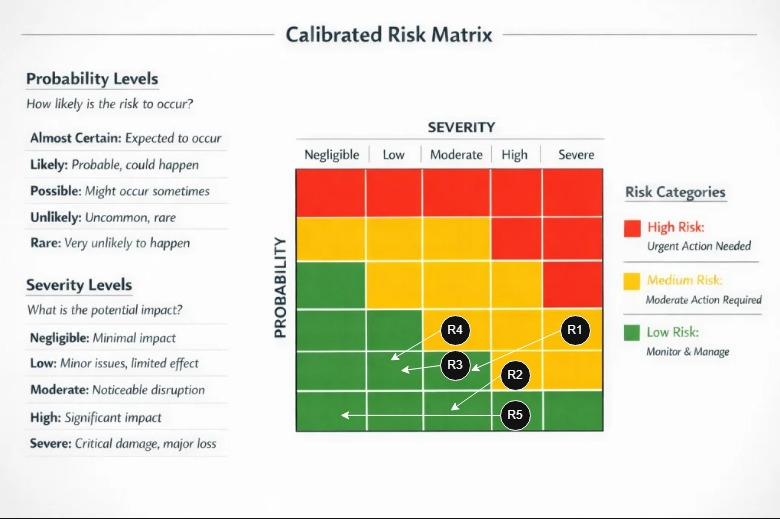
- [source](https://silsafe.net/glossary/risk-matrix/)

# 8. Reflection

This project did not develop in a strictly linear way. Although the report is organized as a sequence of sections, the actual synthesis process was iterative, with later decisions repeatedly forcing refinement of earlier work. As the concept, use cases, sequence diagrams, and requirements became more detailed, they revealed places where the original problem framing, system boundary, and stakeholder definitions needed to be adjusted. In particular, the system became more clearly defined as a scenario-based irrigation planning and decision-support system rather than a simple recommendation dashboard, which led to revisions in the need statement, acceptance criteria, and stakeholder requirements.

The later modeling activities were especially useful because they exposed inconsistencies that were not obvious in the earlier narrative sections. The use case model and sequence diagrams pushed the requirements toward more precise and testable statements, while the QFD analysis clarified which stakeholder concerns were most central to the design. The risk assessment then reinforced those same themes by tying the main risks back to responsiveness, feasibility under constraints, external data dependence, and traceability. Overall, the project showed that systems synthesis is recursive: each later artifact served as a test of earlier assumptions, and the resulting revisions made the final concept more coherent and defensible.